> ⚠️🏗️🚧🦺🧱🪵🪨🪚🛠️👷
> 
> This is a working draft in progress
> 
> 
> 
> ⚠️🏗️🚧🦺🧱🪵🪨🪚🛠️👷


----

# Documentation
> This content is dual-licensed under your choice of the following licenses:
> 1.  **MIT License:** For the code implementations in Swift and Mermaid provided in this document.
> 2.  **Creative Commons Attribution 4.0 International License (CC BY 4.0):** For all other content, including the text, explanations, and the Mermaid diagrams and illustrations.

---

In this documentation, we will provide a comprehensive set of diagrams and illustrations explaining the functionalities and complexities of the Metal Primitives App. These diagrams are intended to serve as a reference for iOS developers who are interested in understanding the app's architecture, rendering pipeline, and how it implements advanced Metal rendering techniques across both iOS and macOS platforms.

---

## Table of Contents
- [Documentation](#documentation)
  - [Table of Contents](#table-of-contents)
  - [1. High-Level Architecture Diagram](#1-high-level-architecture-diagram)
  - [2. App Structure Overview](#2-app-structure-overview)
  - [3. Class Diagram of View Controllers and Wrappers](#3-class-diagram-of-view-controllers-and-wrappers)
  - [4. App Initialization Sequence Diagram](#4-app-initialization-sequence-diagram)
  - [5. Metal Views and Renderers Class Diagram](#5-metal-views-and-renderers-class-diagram)
  - [6. Metal View Rendering Flow Sequence Diagram](#6-metal-view-rendering-flow-sequence-diagram)
  - [7. Platform-Specific View Creation Flowchart](#7-platform-specific-view-creation-flowchart)
  - [8. Extensions and Utilities Relationships Diagram](#8-extensions-and-utilities-relationships-diagram)
  - [9. Metal Rendering Process Flowchart](#9-metal-rendering-process-flowchart)
  - [10. Metal View Hierarchy and Custom Views Diagram](#10-metal-view-hierarchy-and-custom-views-diagram)
  - [11. Configurable References and Protocol Extensions Diagram](#11-configurable-references-and-protocol-extensions-diagram)
  - [12. Core Graphics Extensions and Iterators Diagram](#12-core-graphics-extensions-and-iterators-diagram)
  - [13. CAMetal2DView Class Diagram](#13-cametal2dview-class-diagram)
    - [Class Diagram of `CAMetal2DView` and `MetalState`](#class-diagram-of-cametal2dview-and-metalstate)
    - [Code Architecture Emphasizing Protocols and Extensions](#code-architecture-emphasizing-protocols-and-extensions)
    - [Expanded Class Diagram with `FrameTimer` and Rendering Pipeline](#expanded-class-diagram-with-frametimer-and-rendering-pipeline)
    - [High-Level Overview of Cross-Platform Support](#high-level-overview-of-cross-platform-support)
    - [Platform-Specific Implementation Flowchart](#platform-specific-implementation-flowchart)
  - [14. CAMetal2DView Initialization and Rendering Sequence Diagram](#14-cametal2dview-initialization-and-rendering-sequence-diagram)
  - [15. CAMetal2DView Draw Method Flowchart](#15-cametal2dview-draw-method-flowchart)
  - [16. Shader Structures and Render Pipeline Diagram](#16-shader-structures-and-render-pipeline-diagram)
    - [Timing and Rendering Synchronization with `FrameTimer`](#timing-and-rendering-synchronization-with-frametimer)
    - [Data Flow Diagram of Vertex Data Setup](#data-flow-diagram-of-vertex-data-setup)
    - [Activity Diagram of `MetalState` Initialization](#activity-diagram-of-metalstate-initialization)
  - [17. Thread Safety and Synchronization Diagram](#17-thread-safety-and-synchronization-diagram)
  - [Conclusion](#conclusion)

---

## 1. High-Level Architecture Diagram

This diagram provides an overview of the entire app's architecture, highlighting the conditional compilation for iOS and macOS platforms and how different views are integrated.

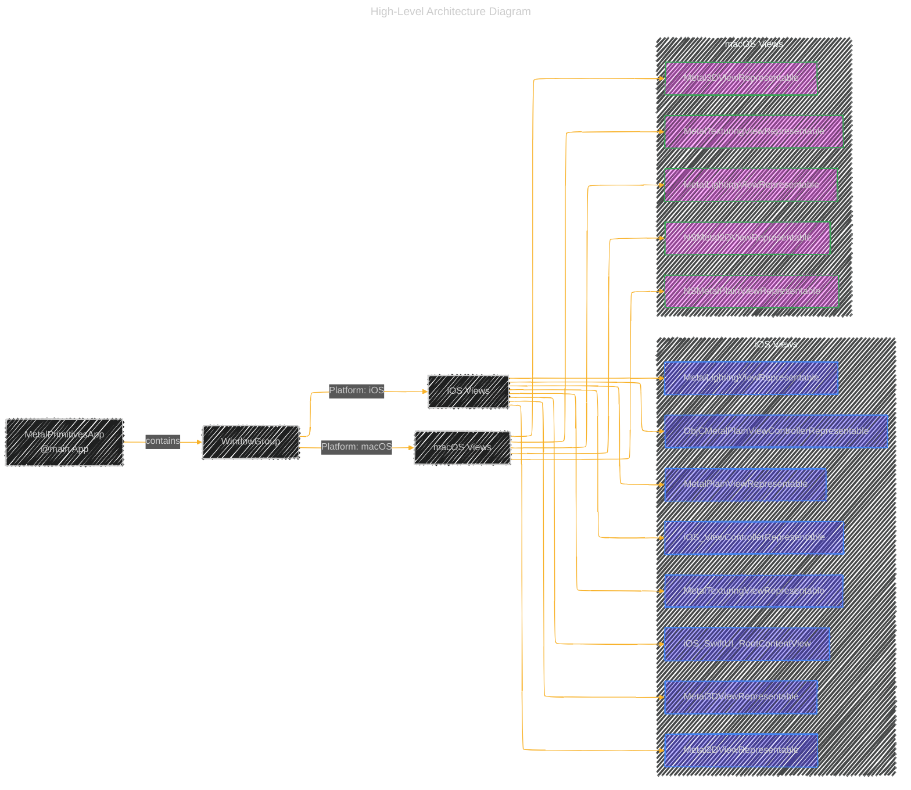

**Explanation:**

- The `MetalPrimitivesApp` uses a `WindowGroup` to host the main content.
- Based on the platform (iOS or macOS), it conditionally includes different views.
- The iOS Views and macOS Views are grouped under their respective platforms.
- Each platform includes a set of representable views that integrate Metal rendering into SwiftUI.

---

## 2. App Structure Overview

This class diagram illustrates the overall structure of the app, focusing on the relationships between the main app entry point, SwiftUI views, and UIKit/AppKit view controllers.

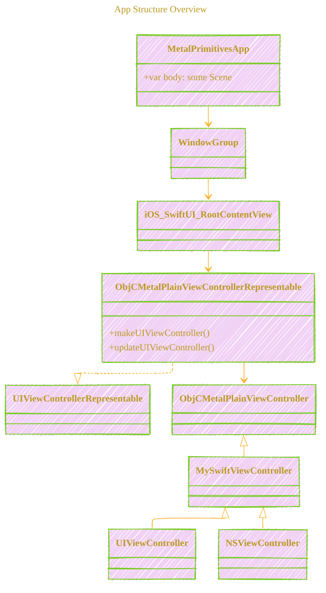

**Explanation:**

- `MetalPrimitivesApp` is the main entry point of the app, containing the `WindowGroup`.
- `iOS_SwiftUI_RootContentView` is the main SwiftUI view for iOS, which uses `ObjCMetalPlainViewControllerRepresentable` to bridge UIKit components.
- `ObjCMetalPlainViewControllerRepresentable` conforms to `UIViewControllerRepresentable` to integrate a UIKit view controller within SwiftUI.
- `ObjCMetalPlainViewController` is an Objective-C view controller that handles Metal rendering.

---

## 3. Class Diagram of View Controllers and Wrappers

This diagram shows how the SwiftUI views, UIKit/AppKit view controllers, and Objective-C view controllers interact.

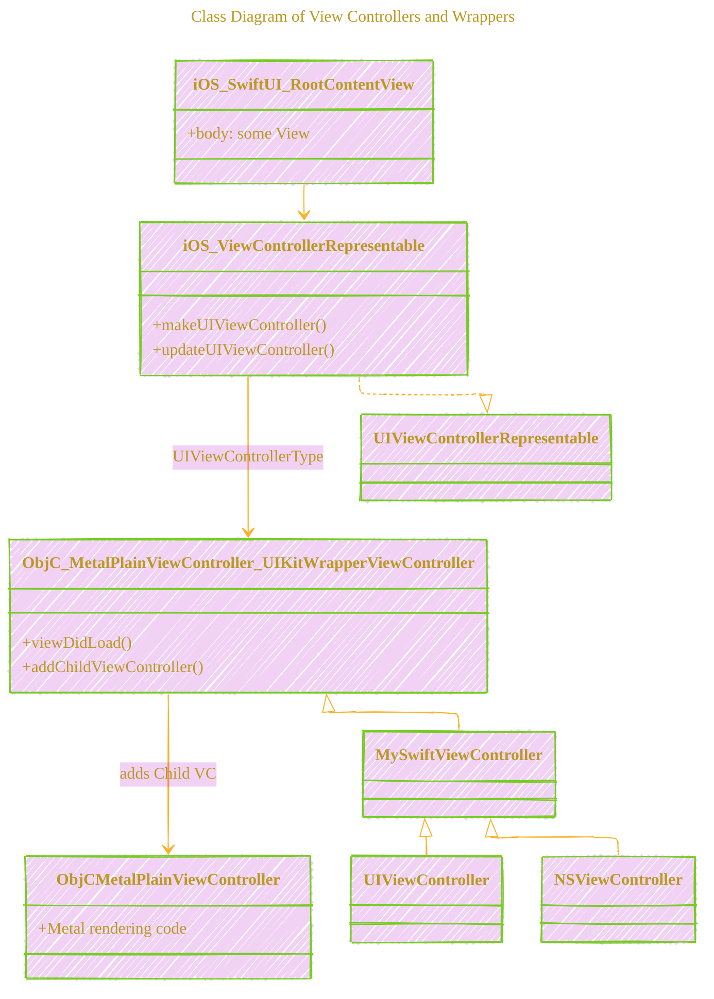

**Explanation:**

- `iOS_SwiftUI_RootContentView` is a SwiftUI view that includes `iOS_ViewControllerRepresentable`.
- `iOS_ViewControllerRepresentable` bridges the UIKit view controller (`ObjC_MetalPlainViewController_UIKitWrapperViewController`) into SwiftUI.
- `ObjC_MetalPlainViewController_UIKitWrapperViewController` is a UIKit view controller that adds the Objective-C Metal view controller as a child.
- `ObjCMetalPlainViewController` is the Objective-C view controller that handles Metal rendering.

---

## 4. App Initialization Sequence Diagram

This sequence diagram illustrates the flow of control during the app's initialization, highlighting how views and view controllers are created and connected.


**Explanation:**

- The app starts by instantiating the `WindowGroup`.
- `WindowGroup` creates the `iOS_SwiftUI_RootContentView`.
- The `iOS_SwiftUI_RootContentView` initializes the `iOS_ViewControllerRepresentable`.
- `iOS_ViewControllerRepresentable` creates the `ObjC_MetalPlainViewController_UIKitWrapperViewController`.
- The wrapper view controller adds `ObjCMetalPlainViewController` as a child.
- Each view controller's `viewDidLoad` method is called appropriately.
- Control returns up the chain, and the window displays the content.

---

## 5. Metal Views and Renderers Class Diagram

This diagram shows the relationship between the Metal views and their respective renderers.

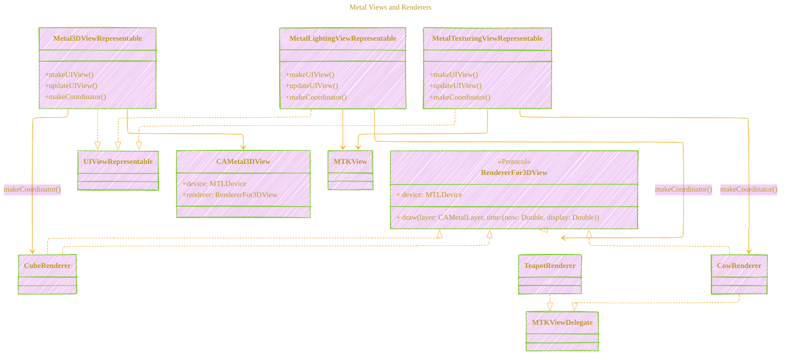

**Explanation:**

- Each representable view conforms to `UIViewRepresentable` and integrates a Metal view into SwiftUI.
- `Metal3DViewRepresentable` uses `CAMetal3DView`, which utilizes a custom renderer (`CubeRenderer`).
- `MetalLightingViewRepresentable` and `MetalTexturingViewRepresentable` use `MTKView` and custom renderers (`TeapotRenderer` and `CowRenderer` respectively).
- Renderers conform to either `RendererFor3DView` protocol or `MTKViewDelegate`.

---

## 6. Metal View Rendering Flow Sequence Diagram

The following sequence diagram demonstrates how the Metal views are created and rendered within the app, showcasing the interaction between SwiftUI, `UIViewRepresentable`, and the Metal rendering pipeline.


**Explanation:**

- The SwiftUI view calls `makeUIView(context)` on the `UIViewRepresentable`.
- The representable creates an instance of the Metal view (`CAMetal3DView` or `MTKView`).
- The Metal view acquires the `MTLDevice` and creates a `MTLCommandQueue`.
- The representable creates a coordinator, which acts as the renderer.
- The Metal view sets its delegate or renderer.
- On each frame, the Metal view calls the renderer's `draw` method to render the frame.

---

## 7. Platform-Specific View Creation Flowchart

This flowchart demonstrates how the code handles platform-specific view creation using conditional compilation.

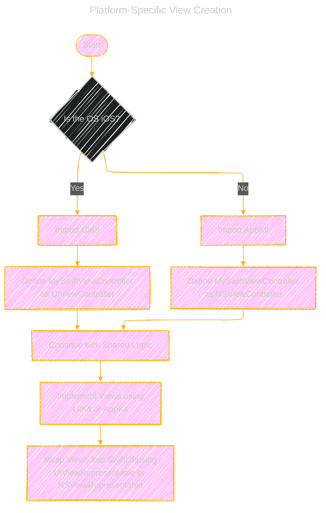

**Explanation:**

- The app starts and checks the operating system.
- If the OS is iOS, it imports UIKit and defines `MySwiftViewController` as `UIViewController`.
- If the OS is macOS, it imports AppKit and defines `MySwiftViewController` as `NSViewController`.
- Shared logic continues, and views are implemented using the appropriate framework.
- Views are wrapped into SwiftUI using the respective representable protocols.

---

## 8. Extensions and Utilities Relationships Diagram

The class diagram below shows how extensions and utilities are designed to add functionality to existing structures like `CGPoint`, `CGSize`, and `CGRect`.

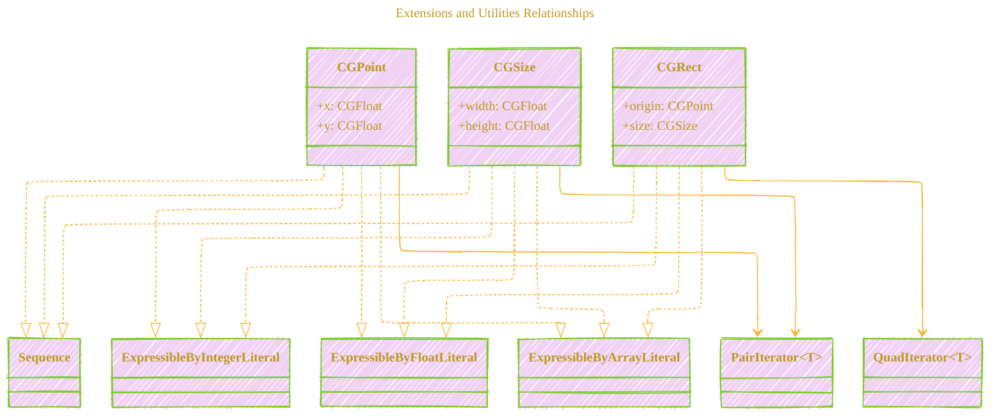

**Explanation:**

- `CGPoint`, `CGSize`, and `CGRect` are extended to conform to `Sequence` and various literal protocols.
- Custom iterators (`PairIterator` and `QuadIterator`) are used to enable iteration over the components of these structures.
- This adds syntactic sugar and convenience when working with these types in code.

---

## 9. Metal Rendering Process Flowchart

This flowchart outlines the steps involved in the `CAMetalPlainView`'s rendering process.

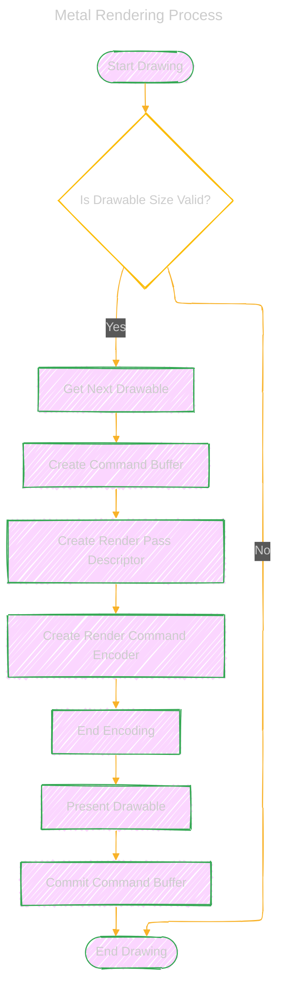

**Explanation:**

- The rendering process starts by checking if the drawable size is valid.
- If valid, it proceeds to get the next drawable from the layer.
- A command buffer is created, along with a render pass descriptor.
- A render command encoder is created to encode rendering commands.
- After encoding, the encoder is ended.
- The drawable is presented, and the command buffer is committed.
- The process ends, ready for the next frame.

---

## 10. Metal View Hierarchy and Custom Views Diagram

This class diagram shows the hierarchy and relationships between custom Metal views and their UIKit/AppKit counterparts, emphasizing the shared logic across platforms.

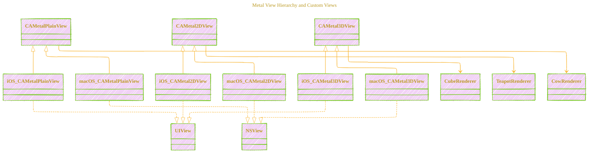

**Explanation:**

- Custom Metal views (`CAMetalPlainView`, `CAMetal2DView`, `CAMetal3DView`) are subclassed for iOS and macOS.
- These subclasses conform to their respective platform's view classes (`UIView` or `NSView`).
- Each Metal view uses a renderer that handles the drawing logic.

---

## 11. Configurable References and Protocol Extensions Diagram

The class diagram below illustrates how protocols and extensions are used to provide configurable references across different types, enhancing code reusability and readability.

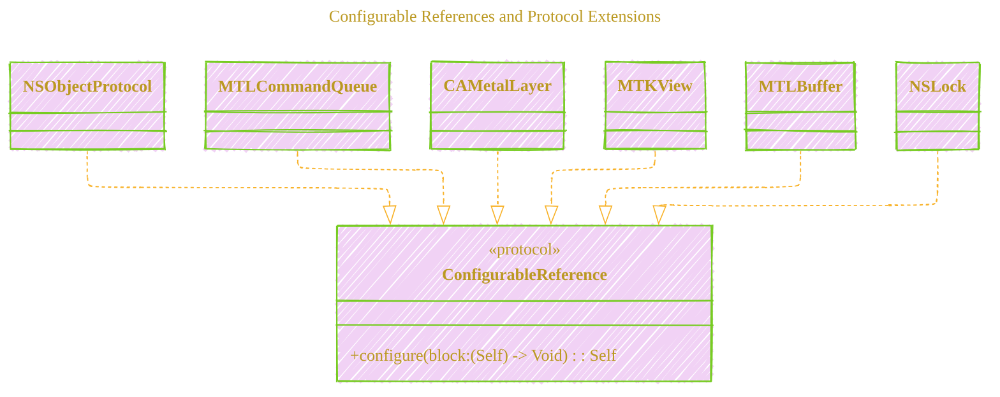

**Explanation:**

- The `ConfigurableReference` protocol allows objects to be configured using a closure.
- Several classes conform to this protocol, making it convenient to chain configurations.
- The protocol extension provides a default implementation for any `NSObjectProtocol` conforming type.

---

## 12. Core Graphics Extensions and Iterators Diagram

This class diagram demonstrates how custom iterators are implemented for `CGPoint`, `CGSize`, and `CGRect`, enabling them to conform to `Sequence` and various literal protocols.

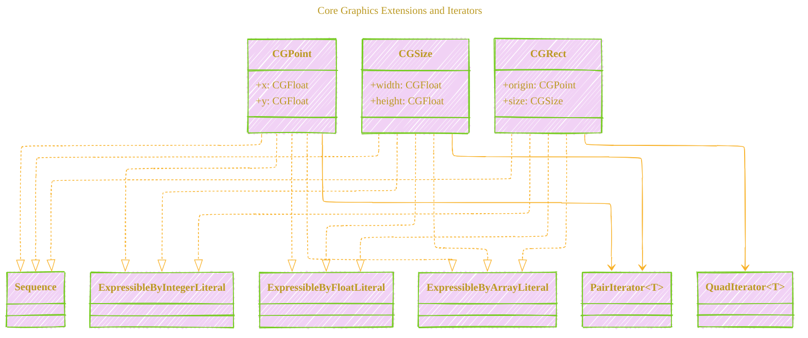

---

## 13. CAMetal2DView Class Diagram

This diagram shows the class hierarchy and composition of `CAMetal2DView` and its inner class `MetalState`.


**Explanation:**
- `CAMetal2DView` is a final class that represents the Metal view, with platform-specific subclasses for macOS (`CAMetal2DViewMac`) and iOS (`CAMetal2DViewiOS`).
- The `MetalState` class encapsulates the Metal rendering state, including the device, command queue, render pipeline state, vertex buffer, Metal layer, and frame timer.
- `MetalState` owns the Metal resources and manages synchronization using a lock.
- `ShaderVertexFor2DView` is a struct representing the vertex data for rendering the triangle.

---


### Class Diagram of `CAMetal2DView` and `MetalState`

This diagram shows the class hierarchy and composition of `CAMetal2DView` and its inner class `MetalState`.

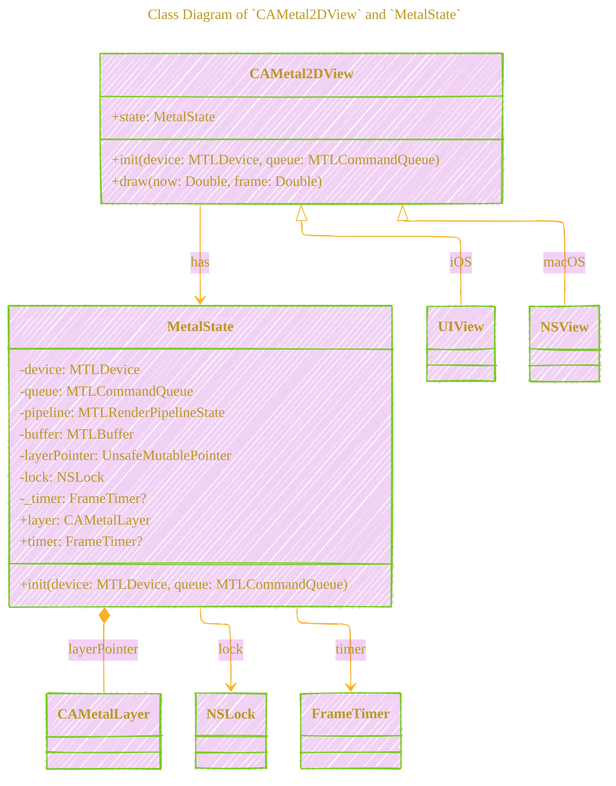

**Explanation:**

- `CAMetal2DView` is a custom view subclassing either `UIView` (for iOS) or `NSView` (for macOS) based on the platform.
- It contains a `MetalState` instance, which holds the Metal rendering state and resources.
- `MetalState` manages the Metal device, command queue, render pipeline state, vertex buffer, and a pointer to the `CAMetalLayer`.
- The `layerPointer` in `MetalState` holds an unsafe pointer to the `CAMetalLayer` associated with the view.
- The `NSLock` is used to synchronize access to the `_timer` property, which manages the rendering loop via `FrameTimer`.

---


### Code Architecture Emphasizing Protocols and Extensions

This diagram highlights how protocols and extensions are used to enhance functionality and maintain code clarity.

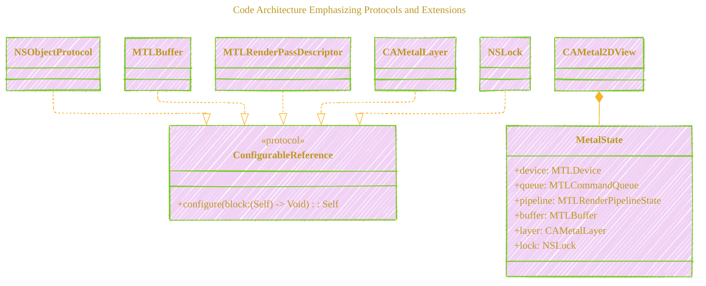


**Explanation:**

- The `ConfigurableReference` protocol provides a `configure` method that allows for inline configuration of objects.
- Extensions conforming various classes like `MTLBuffer`, `MTLRenderPassDescriptor`, `CAMetalLayer`, and `NSLock` to `ConfigurableReference` enable cleaner and more readable code by chaining configuration calls.
- This approach enhances code maintainability and expressiveness.

---


### Expanded Class Diagram with `FrameTimer` and Rendering Pipeline

This diagram goes deeper into how the `FrameTimer`, shaders, and rendering pipeline are set up and used.

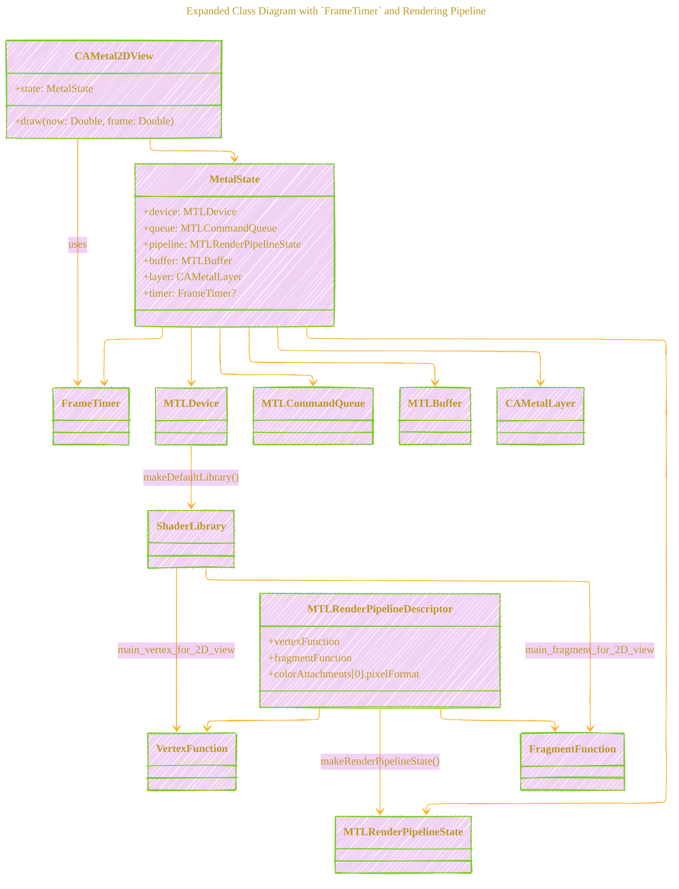

**Explanation:**

- The `MetalState` initializes the Metal pipeline by obtaining the default shader library from the device and setting up the vertex and fragment functions.
- It creates a `MTLRenderPipelineDescriptor`, sets the functions and pixel format, and creates the `MTLRenderPipelineState`.
- The `FrameTimer` is used to synchronize the rendering with the display's refresh rate, calling the `draw` method on each frame.

---


### High-Level Overview of Cross-Platform Support

This diagram highlights how `CAMetal2DView` handles cross-platform support using conditional compilation.

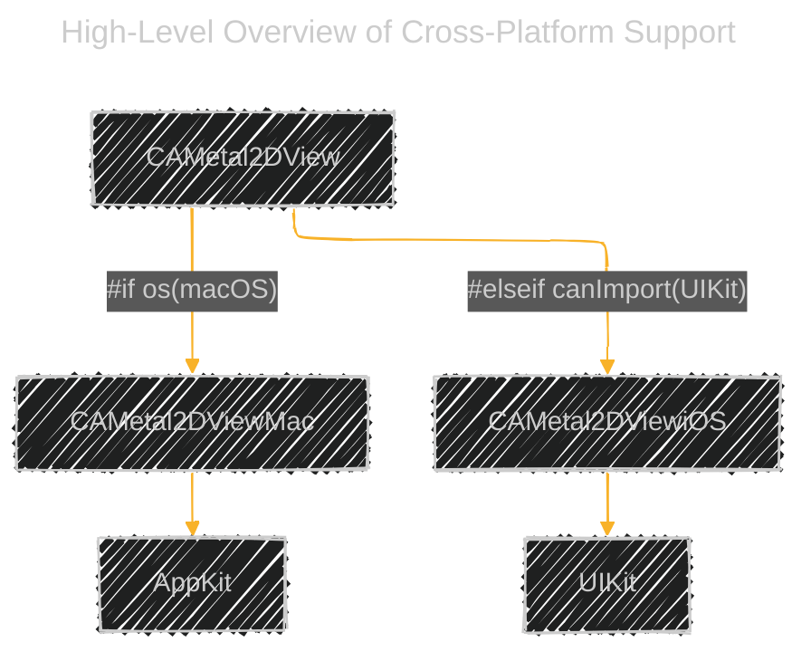


**Explanation:**

- `CAMetal2DView` has platform-specific implementations for macOS and iOS, using `#if` and `#elseif` directives.
- On macOS, `CAMetal2DView` subclasses `NSView` and imports `AppKit`.
- On iOS, `CAMetal2DView` subclasses `UIView` and imports `UIKit`.
- This allows the same class to be used on both platforms with the appropriate behavior and API usage.

---


### Platform-Specific Implementation Flowchart

This flowchart shows the conditional compilation and platform-specific implementations in `CAMetal2DView`.

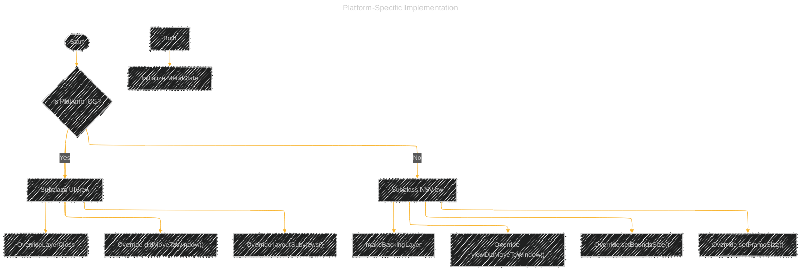


**Explanation:**

- The code uses `#if` directives to differentiate between platforms.
- On iOS, `CAMetal2DView` subclasses `UIView` and overrides `didMoveToWindow()` and `layoutSubviews()`.
- On macOS, `CAMetal2DView` subclasses `NSView` and overrides `viewDidMoveToWindow()`, `setBoundsSize()`, and `setFrameSize()`.
- Both implementations initialize `MetalState` and set up the `CAMetalLayer`.

---

## 14. CAMetal2DView Initialization and Rendering Sequence Diagram

This diagram shows the sequence of events during initialization and the rendering loop of `CAMetal2DView`.


---

## 15. CAMetal2DView Draw Method Flowchart

This flowchart details the steps taken within the `draw(now: frame:)` method during each frame of rendering.


---

## 16. Shader Structures and Render Pipeline Diagram

This class diagram illustrates the `ShaderVertexFor2DView` struct and its role in the rendering pipeline.

```mermaid
---
title: "Shader Structures and Render Pipeline"
config:
  layout: elk
  look: handDrawn
  theme: base
---
%%%%%%%% Mermaid version v11.4.1-b.14
%%{
  init: {
    "classDiagram": { "htmlLabels": false },
    'fontFamily': 'Fantasy',
    'themeVariables': {
      'primaryColor': '#B2C3',
      'primaryTextColor': '#B92',
      'primaryBorderColor': '#7c2',
      'lineColor': '#F8B229'
    }
  }
}%%
classDiagram
    class ShaderVertexFor2DView {
        +position: SIMD4<Float>
        +color: SIMD4<Float>
    }

    class MTLBuffer
    MetalState --> MTLBuffer : buffer
    MTLBuffer --> ShaderVertexFor2DView

    %% Shaders
    class MTLLibrary
    MetalState --> MTLLibrary : makeDefaultLibrary()
    MTLLibrary --> VertexFunction : makeFunction(name "main_vertex_for_2D_view")
    MTLLibrary --> FragmentFunction : makeFunction(name "main_fragment_for_2D_view")

    MetalState --> MTLRenderPipelineDescriptor : descriptor
    MTLRenderPipelineDescriptor --> VertexFunction
    MTLRenderPipelineDescriptor --> FragmentFunction

```

**Explanation:**

- `ShaderVertexFor2DView` defines the vertex data structure used in the shaders.
- `MTLBuffer` holds the vertex data.
- The Metal library loads the shader functions used in the render pipeline.
- The pipeline descriptor references the vertex and fragment shader functions.


### Timing and Rendering Synchronization with `FrameTimer`

This sequence diagram illustrates how the `FrameTimer` is used to synchronize rendering with the display's refresh rate.

```mermaid
---
title: "Timing and Rendering Synchronization with `FrameTimer`"
author: "Cong Le"
version: "0.1"
license(s): "MIT, CC BY 4.0"
copyright: "Copyright (c) 2025 Cong Le. All Rights Reserved."
config:
  layout: elk
  theme: base
---
%%%%%%%% Mermaid version v11.4.1-b.14
%%{
  init: {
    'sequence': { 'mirrorActors': true, 'showSequenceNumbers': true, 'actorMargin': 50 },
    'fontFamily': 'Monaco',
    'themeVariables': {
      'primaryColor': '#2BB8',
      'primaryBorderColor': '#7C0000',
      'lineColor': '#F8B229',
      'secondaryColor': '#6122',
      'tertiaryColor': '#fff',
      'fontSize': '15px',
      'textColor': '#F8B229',
      'actorTextColor': '#E2E',
      'stroke':'#033',
      'stroke-width': '0.2px'
    }
  }
}%%
sequenceDiagram
    participant View as CAMetal2DView
    participant State as MetalState
    participant Timer as FrameTimer
    participant Display

    View->>State: Initialize MetalState
    View->>State: Set timer to nil
    View->>View: didMoveToWindow / viewDidMoveToWindow
    View->>State: Set up layer properties
    State->>State: Set timer with FrameTimer
    Timer-->>View: draw(now, frame)
    View->>Display: Render frame
    loop Every Frame
        Display-->>Timer: VSync Signal
        Timer-->>View: draw(now, frame)
        View->>Display: Render frame
    end
```

**Explanation:**

- When the view moves to the window, it initializes the `FrameTimer` in the `MetalState`.
- The `FrameTimer` invokes the `draw(now:frame:)` method on every display refresh (VSync).
- This ensures smooth frame updates synchronized with the display's refresh rate.
- The rendering loop continues as long as the timer is active.


---

### Data Flow Diagram of Vertex Data Setup

This diagram shows how the vertex data is set up and supplied to the vertex shader.

```mermaid
---
title: "Data Flow Diagram of Vertex Data Setup"
author: "Cong Le"
version: "1.0"
license(s): "MIT, CC BY-SA 4.0"
copyright: "Copyright (c) 2025 Cong Le. All Rights Reserved."
config:
  layout: elk
  theme: dark
  look: handDrawn
---
%%%%%%%% Mermaid version v11.4.1-b.14
%%%%%%%% Available curve styles include the following keywords:
%% basis, bumpX, bumpY, cardinal, catmullRom, linear, monotoneX, monotoneY, natural, step, stepAfter, stepBefore.
%%{
  init: {
    'securityLevel': 'loose',
    'flowchart': { 'htmlLabels': true, 'curve': 'basis' },
    'fontFamily': 'Comic Sans MS, cursive, sans-serif',
    'themeVariables': {
      'primaryColor': '#F3E333',
      'primaryTextColor': '#145A32',
      'lineColor': '#F8B229',
      'primaryBorderColor': '#27AE60',
      'secondaryColor': '#EBDEF0',
      'secondaryTextColor': '#6C3483',
      'secondaryBorderColor': '#A569BD',
      'fontSize': '15px'
    }
  }
}%%
flowchart LR
    Start[Start_Initialization]
    --> CreateVertices[Create Vertices Array]
    --> CalculateLength[Calculate Buffer Length]
    --> CreateBuffer[Create MTLBuffer with Vertex Data]
    --> SetBufferLabel[Set Buffer Label]
    --> UseBuffer[Use Buffer in Encoder]
    --> VertexShader[Vertex Shader Receives Data]

    subgraph Vertex_Data [Vertex_Data]
        ShaderVertexFor2DView1((Top Vertex))
        ShaderVertexFor2DView2((Left Vertex))
        ShaderVertexFor2DView3((Right Vertex))
    end

    CreateVertices --> Vertex_Data
```

**Explanation:**

- An array of `ShaderVertexFor2DView` structs is created, representing the vertices of a triangle.
- Each vertex includes position and color data.
- The total length is calculated based on the number of vertices and the size of the struct.
- A `MTLBuffer` is created with the vertex data and labeled.
- The buffer is set in the render command encoder for use in the vertex shader.


### Activity Diagram of `MetalState` Initialization

This diagram shows the steps involved in initializing the `MetalState` object.

```mermaid
---
title: "Activity Diagram of `MetalState` Initialization"
author: "Cong Le"
version: "1.0"
license(s): "MIT, CC BY-SA 4.0"
copyright: "Copyright (c) 2025 Cong Le. All Rights Reserved."
config:
  layout: elk
  theme: dark
  look: handDrawn
---
%%%%%%%% Mermaid version v11.4.1-b.14
%%%%%%%% Available curve styles include the following keywords:
%% basis, bumpX, bumpY, cardinal, catmullRom, linear, monotoneX, monotoneY, natural, step, stepAfter, stepBefore.
%%{
  init: {
    'securityLevel': 'loose',
    'flowchart': { 'htmlLabels': true, 'curve': 'basis' },
    'fontFamily': 'Comic Sans MS, cursive, sans-serif',
    'themeVariables': {
      'primaryColor': '#F3E333',
      'primaryTextColor': '#145A32',
      'lineColor': '#F8B229',
      'primaryBorderColor': '#27AE60',
      'secondaryColor': '#EBDEF0',
      'secondaryTextColor': '#6C3483',
      'secondaryBorderColor': '#A569BD',
      'fontSize': '15px'
    }
  }
}%%
flowchart TD
%%%%%% Define styles
%% Define style for crtitical points on the flowchart
classDef Decision fill:#F7E6,stroke:#FBBC05,stroke-width:2px
classDef StartEndInitialization fill:#119F00, stroke:#333, stroke-width:2px
classDef ReturnNil fill:#7222F1, stroke:#34A853, stroke-width:2px

%% Define style for question
classDef CheckLibrary fill:#ff0000, stroke:#333, stroke-width:2px
classDef CheckPipelineState fill:#ff0000, stroke:#333, stroke-width:2px
classDef CheckBuffer fill:#ff0000, stroke:#333, stroke-width:2px

%% Define style for operators
classDef PipelineStateOperators fill:#00008B, stroke:#333, stroke-width:1px
classDef VertexBufferOperators fill:#8B8000, stroke:#333, stroke-width:1px
classDef OtherCommandOperators fill:#2F23, stroke:#333, stroke-width:1px


%%%%%% Starting the flowchart
    Start([Start MetalState.init]):::StartEndInitialization
	Start --> CheckLibrary{Make Default Library?}:::CheckLibrary
    CheckLibrary -- No --> ReturnNil[Return nil]
    CheckLibrary -- Yes --> GetFunctions[Get Vertex and Fragment Functions]:::PipelineStateOperators
    
    
    CreateDescriptor[Create Render Pipeline Descriptor]:::PipelineStateOperators

	GetFunctions -->  CreateDescriptor

    CreatePipelineState[Create Render Pipeline State]:::PipelineStateOperators
	
	CreateDescriptor -->  CreatePipelineState
    
    CreatePipelineState --> CheckPipelineState{Pipeline State Created?}:::CheckPipelineState

    CheckPipelineState -- No --> ReturnNil
    CheckPipelineState -- Yes --> CreateVertices[Create Vertex Data]:::VertexBufferOperators
    CreateVertices --> CreateBuffer[Create Vertex Buffer]:::VertexBufferOperators
    CreateBuffer --> CheckBuffer{Buffer Created?}:::CheckBuffer
    CheckBuffer -- No --> ReturnNil:::ReturnNil
    CheckBuffer -- Yes --> InitLayerPointer[Initialize Layer Pointer]:::OtherCommandOperators
    InitLayerPointer --> InitLock[Initialize NSLock]:::OtherCommandOperators
    InitLock --> End([End Initialization]):::StartEndInitialization
    
```

**Explanation:**

- The `MetalState` initializer first attempts to create the default Metal library.
- It retrieves the vertex and fragment functions needed for the pipeline.
- A render pipeline descriptor is created using these functions.
- The render pipeline state is created from the descriptor.
- Vertex data for the triangle is created and stored in a buffer.
- An unsafe pointer to the `CAMetalLayer` is allocated.
- An `NSLock` is initialized for thread safety.
- If any step fails, the initializer returns `nil`, indicating failure.


---

## 17. Thread Safety and Synchronization Diagram

This diagram illustrates how the `MetalState` class manages thread safety and synchronization using a lock when accessing the `timer` property.

```mermaid
---
title: "Thread Safety and Synchronization"
config:
  layout: elk
  look: handDrawn
  theme: base
---
%%%%%%%% Mermaid version v11.4.1-b.14
%%{
  init: {
    "classDiagram": { "htmlLabels": false },
    'fontFamily': 'Fantasy',
    'themeVariables': {
      'primaryColor': '#B2C3',
      'primaryTextColor': '#B92',
      'primaryBorderColor': '#7c2',
      'lineColor': '#F8B229'
    }
  }
}%%
classDiagram
    class MetalState {
        -lock: NSLock
        -_timer: FrameTimer?
        +timer: FrameTimer?
        +set timer(FrameTimer?)
        +get timer() FrameTimer?
    }
    MetalState o-- NSLock : uses

    class NSLock {
        +lock()
        +unlock()
        +withLock(block)
    }

    %% Accessing Timer Property
    MetalState --> "lock/unlock" NSLock : when accessing timer
```

**Explanation:**

- `MetalState` uses an `NSLock` to ensure thread safety when accessing or modifying the `_timer` property.
- The `timer` getter and setter methods use the lock to synchronize access.
- This prevents race conditions and ensures that the timer is safely managed across threads.

---

## Conclusion

The provided diagrams offer a comprehensive visual representation of the Metal Primitives App's architecture, rendering pipeline, and class relationships. By examining these diagrams, developers can gain a deeper understanding of:

- How SwiftUI integrates with UIKit and AppKit through representable protocols.
- The rendering process using Metal, including device and command queue setup, pipeline configuration, and shader usage.
- The handling of platform-specific code using conditional compilation.
- The advanced rendering techniques implemented, such as lighting and texturing in custom shaders.
- The importance of thread safety and synchronization in managing rendering loops and state.

These visual aids serve as valuable references for developers looking to explore or extend the functionalities of the app, providing insights into best practices for cross-platform Metal rendering applications.


---

```mermaid
---
title: "CongLeSolutionX"
author: "Cong Le"
version: "1.0"
license(s): "MIT, CC BY 4.0"
copyright: "Copyright (c) 2025 Cong Le. All Rights Reserved."
config:
  theme: base
---
%%%%%%%% Mermaid version v11.4.1-b.14
%%{
  init: {
    'flowchart': { 'htmlLabels': false },
    'fontFamily': 'Brush Script MT',
    'themeVariables': {
      'primaryColor': '#fc82',
      'primaryTextColor': '#F8B229',
      'primaryBorderColor': '#27AE60',
      'secondaryColor': '#81c784',
      'secondaryTextColor': '#6C3483',
      'lineColor': '#F8B229',
      'fontSize': '20px'
    }
  }
}%%
flowchart LR
    My_Meme@{ img: "https://github.com/CongLeSolutionX/MY_GRAPHIC_ASSETS/blob/Designing_graphic_syntax/MY_MEME_ICONS/Orange-Cloud-Search-Icon-Base-Color-Black-1024x1024.png?raw=true", label: "Ăn uống gì chưa ngừi đẹp?", pos: "b", w: 200, h: 150, constraint: "on" }

    Closing_quote@{ shape: braces, label: "Math and code work together to bring interactive art to life!" }

My_Meme ~~~ Closing_quote
Link_to_my_profile{{"<a href='https://github.com/CongLeSolutionX/CongLeSolutionX' target='_blank'>Click here if you care about my profile</a>"}}

Closing_quote ~~~ My_Meme
My_Meme animatingEdge@--> Link_to_my_profile
animatingEdge@{ animate: true }


```

----


**Licenses:**

- **MIT License:**  [](LICENSE) - Full text in [LICENSE](LICENSE) file.
- **Creative Commons Attribution 4.0 International:** [](LICENSE-CC-BY) - Legal details in [LICENSE-CC-BY](LICENSE-CC-BY) and at [Creative Commons official site](http://creativecommons.org/licenses/by/4.0/).

---
