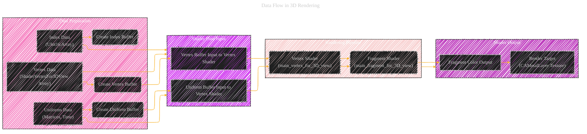

# Documentation - A Consolidated version - Draft 1
> This content is dual-licensed under your choice of the following licenses:
> 1.  **MIT License:** For the code implementations in Swift and Mermaid provided in this document.
> 2.  **Creative Commons Attribution 4.0 International License (CC BY 4.0):** For all other content, including the text, explanations, and the Mermaid diagrams and illustrations.

---


## 1. Project Component Overview (Mindmap)

This mindmap will illustrate the high-level components of the project and their relationships, providing a bird's-eye view.


**Explanation of the Mindmap:**

*   **Core Technologies:**  Highlights the fundamental technologies: Metal for graphics rendering and ARKit for augmented reality features.
*   **Programming Languages:** Shows the use of both Swift and Objective-C, indicating a mixed-language project potentially for bridging or legacy reasons.
*   **View Types:** Lists the different custom views implemented, each showcasing a specific Metal rendering technique or ARKit integration.
*   **Rendering Techniques:**  Summarizes the various rendering approaches demonstrated in the project, from basic clear color to advanced lighting and texturing.
*   **Platform Support:** Explicitly states that the project is designed to run on both iOS and macOS.
*   **Architecture:**  Indicates the architectural patterns used, such as MVC in UIKit/AppKit and the Representable pattern for SwiftUI integration.
*   **Utilities:** Points out the supporting utility classes and extensions that enhance functionality and code organization.

---

## 2. Metal Rendering Pipeline Flowchart

This flowchart illustrates the common steps in the Metal rendering pipeline used across different `CAMetalView` implementations.


**Explanation of the Rendering Pipeline Flowchart:**

*   **Metal Setup:** Initializes the essential Metal components - the `MTLDevice` (representing the GPU) and `MTLCommandQueue` (to manage command execution).
*   **Per-Frame Operations:**  This section is executed every frame. It starts by acquiring a `CAMetalDrawable` from the `CAMetalLayer`, which represents the surface to draw on. If a drawable is available, it proceeds; otherwise, it ends the frame. A `MTLCommandBuffer` is then created to hold rendering commands, followed by setting up a `MTLRenderPassDescriptor` that configures the rendering target (texture, clear color, etc.). A `MTLRenderCommandEncoder` is then created to encode the actual drawing commands.
*   **Encoding Commands:**  This is where the specific rendering instructions are encoded. It includes setting the render pipeline state (shaders), depth-stencil state (for depth testing in 3D), vertex buffers (geometry data), uniform buffers (parameters for shaders), and textures (for texturing). Finally, `drawPrimitives` or `drawIndexedPrimitives` commands are issued to render the geometry. `endEncoding` signals the completion of command encoding for this render pass.
*   **Presentation:** After encoding, the drawable is presented to the screen using `commandBuffer.present(drawable)`, and the command buffer is committed to the `MTLCommandQueue` using `commandBuffer.commit()` for GPU execution.

---

## 3. Class Relationship Diagram (Swift & Objective-C Views and Renderers)

This class diagram focuses on the Swift and Objective-C view classes and their relationships with renderers and representable structs.


**Explanation of the Class Diagram:**

*   **View Hierarchy:** Shows the custom `CAMetalPlainView`, `CAMetal2DView`, `CAMetal3DView` extending `UIView` (or `NSView` on macOS) to host `CAMetalLayer` for Metal rendering. `MTKView` is also used, which is a higher-level MetalKit view.
*   **Metal State Management:**  `CAMetal2DView` and `CAMetal3DView` utilize a `MetalState` class to encapsulate Metal device, command queue, pipeline state, and buffers, promoting code organization and reusability.
*   **Renderers:**  The `RendererFor3DView` protocol defines a contract for 3D renderers. `CubeRenderer`, `TeapotRenderer`, and `CowRenderer` are concrete renderer classes responsible for drawing specific 3D scenes (cube, teapot, cow), implementing either `RendererFor3DView` or `MTKViewDelegate` protocols.
*   **SwiftUI Representables:** `MetalPlainViewRepresentable`, `Metal2DViewRepresentable`, `Metal3DViewRepresentable`, `MetalLightingViewRepresentable`, and `MetalTexturingViewRepresentable` are SwiftUI `UIViewRepresentable` (or `NSViewRepresentable` on macOS) structs. These structs bridge the UIKit/AppKit `CAMetalView` and `MTKView` classes into SwiftUI, enabling their use within SwiftUI views. They utilize coordinators (`makeCoordinator()` functions) to manage the renderers (`CubeRenderer`, `TeapotRenderer`, `CowRenderer`).
*   **Objective-C Interoperability:** `ObjCCAMetalPlainView` and `ObjCMetalPlainViewController` demonstrate how to create Metal views and view controllers in Objective-C. `ObjCMetalPlainViewControllerRepresentable` is a SwiftUI `UIViewControllerRepresentable` that allows embedding the Objective-C view controller into SwiftUI.
*   **Relationships:** Associations (lines) show usage relationships (e.g., `CAMetal2DView` uses `MetalState`). Inheritance (`--|>`) indicates class extension, and implementation (`--|>`) shows protocol conformance.

---

## 4. ARKit Session and Sphere Placement Sequence Diagram

This sequence diagram illustrates the interaction flow when the user taps the AR screen to place a sphere.


**Explanation of the ARKit Sequence Diagram:**

1.  **User Tap Gesture:** The user initiates the sphere placement by tapping on the AR view.
2.  **Gesture Recognition:** `ARKitViewController`'s `tapGestureRecognized(_:)` method is triggered.
3.  **Frame Acquisition:** The view controller gets the current AR frame from the `ARSession` to access camera information.
4.  **Transform Calculation:** `ARKitViewController` calculates the `sphereTransform` based on the camera's transform and a fixed offset in front of the camera.
5.  **Sphere Anchor Creation:** A `SphereAnchor` object is instantiated with the calculated transform.
6.  **Anchor Addition:** The `SphereAnchor` is added to the `ARSession`.
7.  **Renderer Delegate Callback:** ARKit informs the `ARSceneRendererDelegate` about a new anchor being added via `renderer(_:didAdd:for:)`.
8.  **Anchor Type Check:** The delegate checks if the added anchor is a `SphereAnchor`.
9.  **Sphere Geometry Creation:**  If it's a `SphereAnchor`, the delegate creates an `SCNSphere` geometry and sets its visual properties (radius, color).
10. **Node Setup and Attachment:** An `SCNNode` is created, its geometry is set to the sphere geometry, and it's added as a child node to the root scene node, effectively rendering the sphere in the AR scene.
11. **Confirmation:**  The sequence diagram ends with confirmations back to the `ARKitViewController` and visual feedback to the user as the sphere appears in the AR scene.

---

## 5. Language Interoperability Component Diagram

This diagram highlights how Objective-C and Swift components interact within the project.

```mermaid
componentDiagram
    Swift_Code [
        <<Swift>>
        MetalViewRepresentables
        CAMetal2DView
        CAMetal3DView
        CAMetalPlainView
        CubeRenderer
        TeapotRenderer
        CowRenderer
        ARKitViewController
        ARSceneRendererDelegate
        SphereAnchor
        ... (Swift Extensions)
    ]
    ObjectiveC_Code [
        <<Objective-C>>
        ObjCCAMetalPlainView
        ObjCMetalPlainViewController
        Metal-Primitives-Bridging-Header.h
        ObjCCAMetalPlainView.h
        ObjCCAMetalPlainViewController.h
        ObjCCAMetalPlainView.m
        ObjCMetalPlainViewController.m
    ]
    Metal_Shaders [
        <<Metal Shading Language (MSL)>>
        ShaderFor2DView.metal
        ShaderVertexFor3DView.metal
        ShaderForLightingView.metal
        ShaderForTexturingView.metal
    ]
    SwiftUI_Framework [
        <<SwiftUI>>
        ContentView.swift
        Metal_PrimitivesApp.swift
        ObjCMetalPlainViewControllerRepresentable.swift
        MetalPlainViewRepresentable.swift
        Metal2DViewRepresentable.swift
        Metal3DViewRepresentable.swift
        MetalLightingViewRepresentable.swift
        MetalTexturingViewRepresentable.swift
        iOS_ViewControllerRepresentable.swift
    ]
    UIKit_AppKit_Framework [
        <<UIKit/AppKit>>
        CAMetalLayer
        UIView/NSView
        UIViewController/NSViewController
        GestureRecognizers
        ...
    ]
    Metal_Framework [
        <<Metal>>
        MTLDevice
        MTLCommandQueue
        MTLBuffer
        MTLTexture
        MTLRenderPipelineState
        MTLRenderCommandEncoder
        ...
    ]
    ARKit_Framework [
        <<ARKit>>
        ARSession
        ARSCNView
        ARAnchor
        ARFrame
        ARWorldTrackingConfiguration
        ...
    ]
    SceneKit_Framework [
        <<SceneKit>>
        SCNSceneRenderer
        SCNNode
        SCNGeometry
        SCNSphere
        ARSCNPlaneGeometry
        ...
    ]

    SwiftUI_Framework --.-> Swift_Code : Uses
    UIKit_AppKit_Framework --.-> Swift_Code : Uses
    Metal_Framework --.-> Swift_Code : Uses
    ARKit_Framework --.-> Swift_Code : Uses
    SceneKit_Framework --.-> Swift_Code : Uses
    ObjectiveC_Code --.-> UIKit_AppKit_Framework : Uses
    ObjectiveC_Code --.-> Metal_Framework : Uses
    Swift_Code --.-> ObjectiveC_Code : Bridges via Header
    Swift_Code --.-> Metal_Shaders : Uses
    Swift_Code --.-> Metal_Framework : Uses
    Swift_Code --.-> UIKit_AppKit_Framework : Uses
    Swift_Code --.-> ARKit_Framework : Uses
    Swift_Code --.-> SceneKit_Framework : Uses
    Metal_Shaders --.-> Metal_Framework : Relies on
```


Note: 
Below is my workaround diagram for now to convey the meaning of the concept.


**Explanation of the Language Interoperability Component Diagram:**

*   **Swift Code Component:**  Groups all Swift source files, including view representables, custom `CAMetalView` classes, renderers, ARKit integration classes, and utility extensions.
*   **Objective-C Code Component:**  Groups Objective-C source files, primarily focusing on `ObjCCAMetalPlainView` and `ObjCMetalPlainViewController`, showcasing Objective-C Metal usage and bridging with Swift.
*   **Metal Shaders Component:** Represents the Metal Shading Language (.metal) files containing vertex and fragment shaders for different rendering techniques.
*   **Framework Components:** Includes SwiftUI, UIKit/AppKit, Metal, ARKit, and SceneKit frameworks, highlighting the external dependencies.
*   **Bridging and Dependencies:** Arrows indicate dependencies and interactions. Swift code bridges to Objective-C via the bridging header (`Metal-Primitives-Bridging-Header.h`). Both Swift and Objective-C code utilize system frameworks like UIKit/AppKit, Metal, ARKit, and SceneKit. Metal shaders are used by Swift code for rendering.

---

## 6. Data Flow in 3D Rendering (Flowchart)

This flowchart visualizes the data flow specifically for the 3D rendering pipeline, like in `CubeRenderer`.



**Explanation of the 3D Rendering Data Flow Flowchart:**

*   **Data Preparation:** This section describes the initial data setup. Vertex data (positions, colors), index data (for indexed drawing), and uniform data (matrices, time-dependent parameters) are prepared in Swift and then used to create corresponding Metal buffers (`MTLBuffer`).
*   **Rendering Pipeline:**  Represents the core shader stages: the vertex shader (`main_vertex_for_3D_view`) and the fragment shader (`main_fragment_for_3D_view`).
*   **Shader Data Input:** Shows how the prepared buffers feed data to the shaders. The vertex buffer and uniform buffer are set as inputs to the vertex shader.
*   **Shader Output:** The fragment shader outputs color values for each fragment (pixel). These color outputs are then written to the render target, which is the texture of the `CAMetalLayer`, ultimately displayed on the screen.

---

## 7. Platform Abstraction in Views (Component Diagram Snippet)

This snippet focuses on how platform differences are handled in the `CAMetalPlainView` and related classes using conditional compilation.

```mermaid
componentDiagram
    classDef PlatformViewClass fill:#fdd,stroke:#333,stroke-width:1px
    classDef PlatformCode fill:#eed,stroke:#333,stroke-width:1px

    Platform_Abstract_View [
        <<Swift Class>>
        CAMetalPlainView
        CAMetal2DView
        CAMetal3DView
    ]
    Platform_Abstract_View:::PlatformViewClass -- "extends" --> PlatformView [<<Type Definition>> PlatformView]

    subgraph macOS
        macOS_View [
            <<Swift Class (macOS)>>
            CAMetalPlainView
            CAMetal2DView
            CAMetal3DView
        ]
        macOS_View:::PlatformViewClass -- "is typedef as" --> NSView [<<macOS Type>> NSView]
        macOS_Code [
            <<Swift Code (macOS)>>
            #if os(macOS) ... #endif
            Code blocks for macOS specific implementations
        ]:::PlatformCode
    end

    subgraph iOS
        iOS_View [
            <<Swift Class (iOS)>>
            CAMetalPlainView
            CAMetal2DView
            CAMetal3DView
        ]
        iOS_View:::PlatformViewClass -- "is typedef as" --> UIView [<<iOS Type>> UIView]
        iOS_Code [
            <<Swift Code (iOS)>>
            #if canImport(UIKit) ... #endif
            Code blocks for iOS specific implementations
        ]:::PlatformCode
    end

    Platform_Abstract_View -- "contains" --> Platform_Specific_Logic [Platform Specific Logic in CAMetalViews]
    Platform_Specific_Logic -- "implemented using" --> Conditional_Compilation [Conditional Compilation (#if os(macOS), #elseif canImport(UIKit))]
    Conditional_Compilation ..> macOS_Code : For macOS
    Conditional_Compilation ..> iOS_Code : For iOS
```

**Explanation of the Platform Abstraction Diagram Snippet:**

*   **Platform Abstraction:**  `CAMetalPlainView`, `CAMetal2DView`, and `CAMetal3DView` are presented as platform-abstract views, designed to work on both macOS and iOS.
*   **`PlatformView` Typedef:**  A `PlatformView` typedef is used to abstract away the underlying platform-specific view class (`NSView` on macOS, `UIView` on iOS).
*   **Conditional Compilation:**  The diagram highlights the use of conditional compilation (`#if os(macOS)`, `#elseif canImport(UIKit)`) to include platform-specific code blocks within the Swift source files.
*   **Platform-Specific Logic:**  Indicates that `CAMetalView` classes contain platform-specific logic, implemented through these conditional compilation blocks.
---


```mermaid
---
title: "CongLeSolutionX"
author: "Cong Le"
version: "1.0"
license(s): "MIT, CC BY 4.0"
copyright: "Copyright (c) 2025 Cong Le. All Rights Reserved."
config:
  theme: base
---
%%%%%%%% Mermaid version v11.4.1-b.14
%%{
  init: {
    'flowchart': { 'htmlLabels': false },
    'fontFamily': 'Brush Script MT',
    'themeVariables': {
      'primaryColor': '#fc82',
      'primaryTextColor': '#F8B229',
      'primaryBorderColor': '#27AE60',
      'secondaryColor': '#81c784',
      'secondaryTextColor': '#6C3483',
      'lineColor': '#F8B229',
      'fontSize': '20px'
    }
  }
}%%
flowchart LR
    My_Meme@{ img: "https://github.com/CongLeSolutionX/MY_GRAPHIC_ASSETS/blob/Designing_graphic_syntax/MY_MEME_ICONS/Orange-Cloud-Search-Icon-Base-Color-Black-1024x1024.png?raw=true", label: "Ăn uống gì chưa ngừi đẹp?", pos: "b", w: 200, h: 150, constraint: "on" }

    Closing_quote@{ shape: braces, label: "Math and code work together to bring interactive art to life!" }

My_Meme ~~~ Closing_quote

```


---
**Licenses:**

- **MIT License:**  [](LICENSE) - Full text in [LICENSE](LICENSE) file.
- **Creative Commons Attribution 4.0 International:** [](LICENSE-CC-BY) - Legal details in [LICENSE-CC-BY](LICENSE-CC-BY) and at [Creative Commons official site](http://creativecommons.org/licenses/by/4.0/).

----