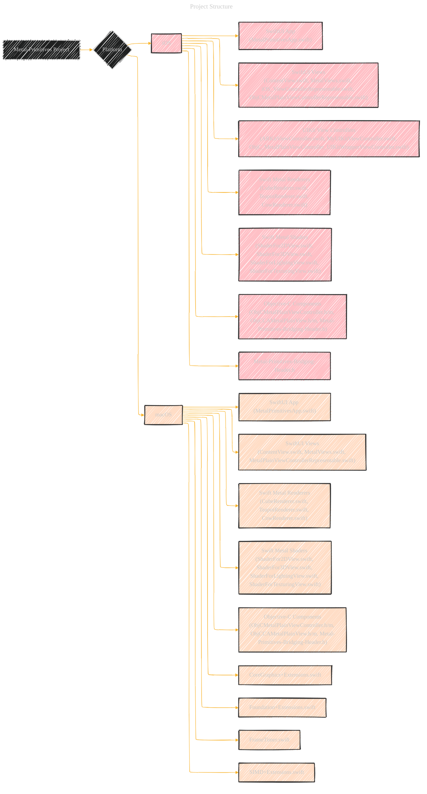
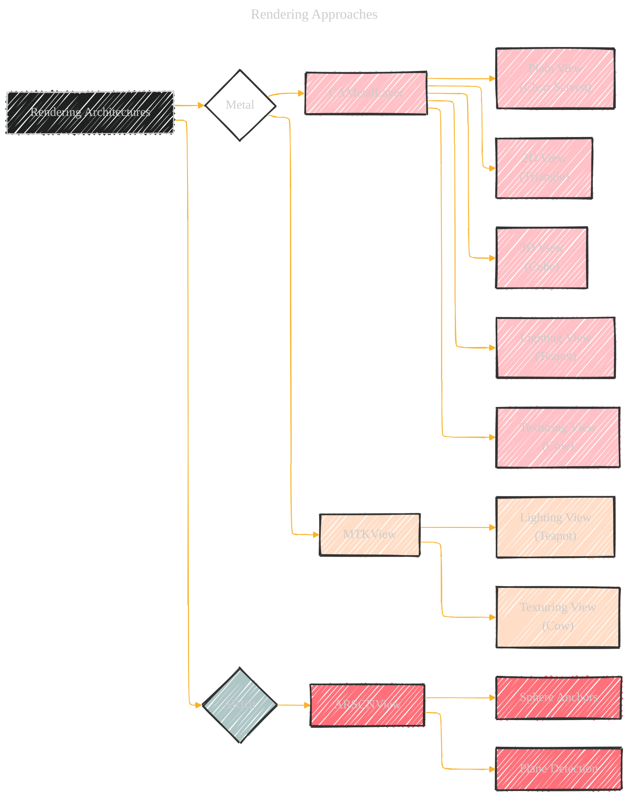
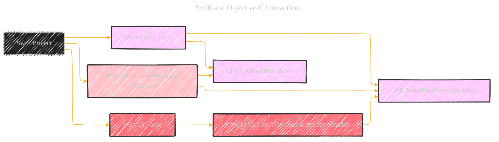
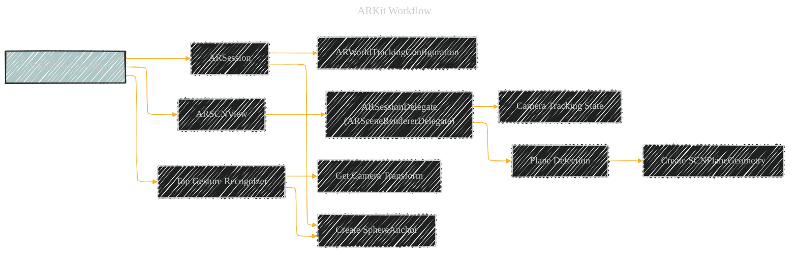
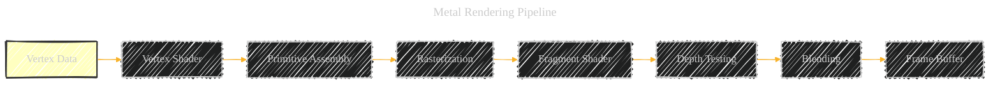
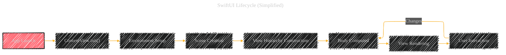
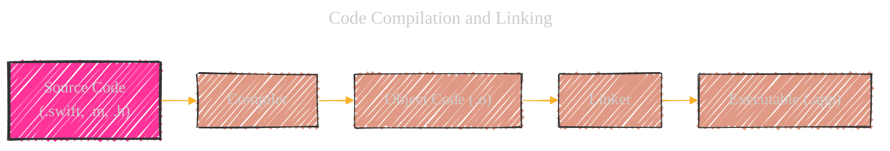

---

  <blockquote>
  As a visual learner student, I created these personal study notes from the cited source(s) to aid my understanding. 
  While my firm intention is to provide full credit, the blended format of notes and diagrams may sometimes obscure the original source, for which I apologize. 
  I am committed to making corrections and welcome any feedback. 
  This is a non-commercial project for my humble educational purposes only since the start. 
  My goal is to share my perspective and contribute to the great work already being done.
   
   
  I want to extend my genuine apologies to the creators of the original material. 
  Their work was the direct inspiration for this project, and I adapted it without first reaching out. 
  My intent comes from a place of deep respect, and I hope this is received in the spirit of homage.
  </blockquote>

----

# Documentation - A Consolidated version - Draft 2

## 1. Project Overview and Structure

This project demonstrates various Metal rendering techniques and integrations within iOS and macOS applications. It leverages Swift, Objective-C, and Metal to showcase different rendering approaches, including:

*   **2D Rendering:** A simple triangle rendered using Metal.
*   **3D Rendering:** A rotating cube rendered with Metal.
*   **Lighting:** Rendering a teapot with lighting effects using Metal.
*   **Texturing:** Rendering a textured object (likely a cow or similar) using Metal.
*   **ARKit Integration:** Integrating ARKit to display a sphere in an augmented reality scene.
*   **SwiftUI Integration:** Uses SwiftUI `Representable` to embed UIKit/AppKit views.
*   **Objective-C Interoperability:** Utilizes Objective-C code ( `ObjCMetalPlainViewController`, `ObjCCAMetalPlainView` ) within a Swift project.

*   This diagram shows the main components of the project, separated by platform (iOS and macOS).
*   It illustrates the dependencies between Swift code (SwiftUI, renderers, shaders), UIKit/AppKit, and Objective-C code.
*   The `Metal-Primitives-Bridging-Header.h` file is crucial for enabling Swift to interact with Objective-C code.

----

## 2.  Rendering Architectures

The project uses several different approaches to render the graphics.

*   **`CAMetalLayer`:** This is a Core Animation layer that allows direct drawing with Metal.
    *   Used in  `CAMetalPlainView`, `CAMetal2DView`, and `CAMetal3DView`.
    *   Offers more control over the rendering process.
*   **`MTKView`:**  A MetalKit view that simplifies Metal integration by handling setup and rendering loop.
    *   Used in `MetalLightingViewRepresentable` and `MetalTexturingViewRepresentable`.
    *   Provides a convenient delegate-based approach.
*   **ARKit:** Used to create an augmented reality experience with ARKit:
    *   The  `ARKitViewController`  class manages an  `ARSession`  and uses an  `ARSCNView`  to display the AR scene.
    *   Detects horizontal planes.
    *   Adds a  `SphereAnchor`  on a tap gesture.

---

## 3. Swift and Objective-C Interaction

The project demonstrates how to integrate Objective-C code into a Swift project.

*   `Metal-Primitives-Bridging-Header.h`: This header file is the bridge between Swift and Objective-C. It's where you import Objective-C header files, making their classes and methods accessible in Swift.
*   `ObjCMetalPlainViewController` and `ObjCCAMetalPlainView`:  These are Objective-C classes that are likely used to create and manage a basic Metal view. The `ObjCMetalPlainViewControllerRepresentable`  wraps the Objective-C controller so that it can be displayed within a SwiftUI environment.

---

## 4. Code Highlights

*   **Metal Setup:**  The code initializes the Metal device (`MTLCreateSystemDefaultDevice()`) and command queue (`makeCommandQueue()`).
*   **Renderers:** `CubeRenderer`, `TeapotRenderer`, and `CowRenderer` encapsulate the logic for drawing 3D objects using Metal. They manage the Metal pipeline, vertex and index buffers, and uniforms.
*   **Shaders:** The Metal shader files (e.g., `ShaderFor2DView.metal`, `ShaderFor3DView.metal`) define the vertex and fragment shaders, which are responsible for transforming vertices and calculating pixel colors.
*   **SwiftUI Integration:**  The `UIViewRepresentable` and `NSViewRepresentable` protocols are used to embed UIKit/AppKit views (including Metal views) within SwiftUI.
*   **ARKit Integration:** The  `ARKitViewController`  class sets up the AR session, detects planes, and adds virtual objects to the AR scene.

---

## 5.  Key Components and Relationships

```mermaid
---
title: Core Data Flow
config:
  layout: elk
  look: handDrawn
  theme: dark
---
%%{
  init: {
    'fontFamily': 'verdana',
    'themeVariables': {
      'primaryColor': '#BB2528',
      'primaryTextColor': '#f529',
      'primaryBorderColor': '#7C0000',
      'lineColor': '#F8B229',
      'secondaryColor': '#006100',
      'tertiaryColor': '#fff'
    }
  }
}%%
graph LR
    A[MetalPrimitivesApp] --> B[SwiftUI Root View]
    B --> C{Platform}
    C --> D[iOS]
    C --> E[macOS]

    D --> F[iOS_SwiftUI_RootContentView]
    F --> G[ObjCMetalPlainViewControllerRepresentable]
    G --> H[ObjCMetalPlainViewController]
    H --> I[ObjCCAMetalPlainView]
    I --> J[CAMetalLayer]

    E --> K[macOS_SwiftUI_RootContentView]
    K --> L[MetalPlainViewControllerRepresentable]
    L --> H
    H --> I
    I --> J

    subgraph Metal_Rendering_Simplified["Metal Rendering<br>(Simplified)"]
    style Metal_Rendering_Simplified fill:#ff45,stroke:#333,stroke-width:2px
        J --> M[Metal Device]
        J --> N[Command Queue]
        J --> O[Render Pipeline]
        J --> P[Vertex Data]
        J --> Q[Fragment Shader]
    end


    classDef Style_for_Swift_Code fill:#f129,stroke:#333,stroke-width:2px
    class B,L,G Style_for_Swift_Code

    classDef Style_for_Bridging_Header_File fill:#f455,stroke:#333,stroke-width:2px
    

    classDef Style_for_ObjC_Code fill:#f3f4,stroke:#333,stroke-width:2px
    class H,I Style_for_ObjC_Code
    
    classDef Style_for_iOS_Platform fill:#f455,stroke:#333,stroke-width:2px
    class D,F Style_for_iOS_Platform

    classDef Style_for_macOS_Platform fill:#f955,stroke:#333,stroke-width:2px
    class E,K Style_for_macOS_Platform
    

    classDef Metal fill:#fff4,stroke:#333,stroke-width:2px
    

    click A "https://developer.apple.com/documentation/swiftui/app"
    click B "https://developer.apple.com/documentation/swiftui/view"
    click C "https://developer.apple.com/documentation/swiftui/view"
    click D "https://developer.apple.com/documentation/swiftui/view"
    click E "https://developer.apple.com/documentation/swiftui/view"
    click F "https://developer.apple.com/documentation/swiftui/view"
    click G "https://developer.apple.com/documentation/swiftui/view"
    click H "https://developer.apple.com/documentation/uikit/uiviewcontroller"
    click I "https://developer.apple.com/documentation/uikit/uiview"
    click J "https://developer.apple.com/documentation/quartzcore/cametallayer"
    click K "https://developer.apple.com/documentation/swiftui/view"
    click L "https://developer.apple.com/documentation/swiftui/view"
    click M "https://developer.apple.com/documentation/metal"
    click N "https://developer.apple.com/documentation/metal"
    click O "https://developer.apple.com/documentation/metal"
    click P "https://developer.apple.com/documentation/metal"
    click Q "https://developer.apple.com/documentation/metal"

```

*   This diagram illustrates the flow of data and control within the application.
*   It shows how the SwiftUI app ( `MetalPrimitivesApp` ) presents views which eventually lead to Metal rendering through the Objective-C Metal views.
*   The simplified Metal rendering section highlights the key steps in Metal's rendering pipeline.

---

## 6. ARKit Workflow

*   This diagram outlines the core steps in the ARKit integration.
*   The  `ARKitViewController`  configures the AR session, sets up the  `ARSCNView`, and handles user interactions.
*   Plane detection is used to create a visual representation of the detected planes.
*   Tap gestures trigger the creation of a  `SphereAnchor`  at the camera's position.

---

## 7. Metal Rendering Pipeline (Simplified)

*   This diagram shows the general stages of a Metal rendering pipeline.
*   **Vertex Data**: Input data, including positions, colors, and texture coordinates.
*   **Vertex Shader**: Transforms vertex data.
*   **Primitive Assembly**: Assembles vertices into primitives (triangles, lines, etc.).
*   **Rasterization**: Converts primitives into fragments (pixels).
*   **Fragment Shader**: Calculates the color of each fragment.
*   **Depth Testing**: Determines which fragments are visible based on their depth.
*   **Blending**: Combines fragment colors.
*   **Frame Buffer**: The final output, which is displayed on the screen.

---

## 8. SwiftUI Lifecycle (Simplified)

*   This diagram shows a high-level overview of a SwiftUI app's lifecycle.
*   **App Launch:** The application starts.
*   **`ContentView.init()`:** The main view is initialized.
*   **Environment Setup:**  The SwiftUI environment is set up.
*   **Scene Creation:** The app creates the scene.
*   **View Hierarchy Construction:** SwiftUI builds the view hierarchy.
*   **Body Computed:** The `body` property of views is computed to describe their content.
*   **View Rendering:** The view is rendered on the screen.
*   **User Interaction:** User actions trigger updates, potentially causing the `body` to be recomputed and the view to be re-rendered.

---

## 9. Code Compilation and Linking

*   **Source Code:** The `.swift`, `.m`, and `.h` files.
*   **Compiler:** Transforms the source code into object code (`.o`).
*   **Linker:** Combines the object code files, resolves dependencies, and creates the executable application (`.app`).

---

## 10. Extensions and Utilities

*   **`CoreGraphics+Extensions.swift`:**  Provides extensions to Core Graphics types (like `CGPoint`, `CGSize`, `CGRect`) to make them conform to protocols like `Sequence` and `ExpressibleByArrayLiteral`. This enhances their usability in Swift code.
*   **`Foundation+Extensions.swift`:**  Contains extensions for Foundation classes. This file includes `ConfigurableReference` which simplifies the configuration of objects using a closure-based approach, and also extension for String to create bundle identifier.
*   **`FrameTimer.swift`:** Implements a frame timer to synchronize rendering with the display's refresh rate.  It uses `CVDisplayLink` on macOS and `CADisplayLink` on iOS.
*   **`SIMD+Extensions.swift`:** Provides useful extensions for SIMD (Single Instruction, Multiple Data) types, commonly used in Metal for vector and matrix operations. Includes convenient properties and methods.

----
