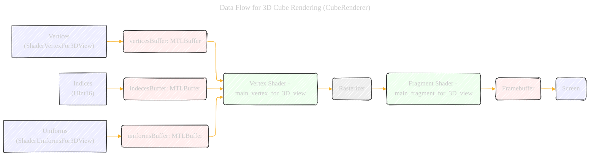
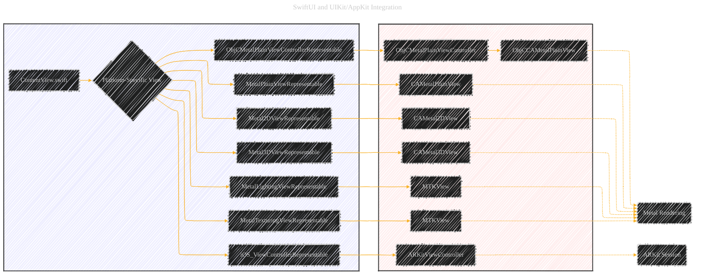
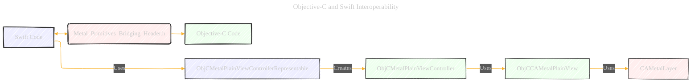
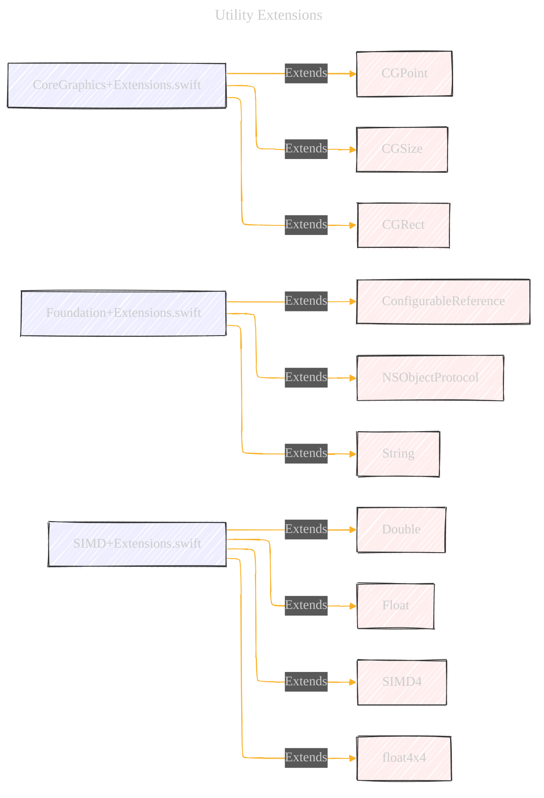

> ⚠️🏗️🚧🦺🧱🪵🪨🪚🛠️👷
> 
> This is a working draft in progress
> 
> 
> 
> ⚠️🏗️🚧🦺🧱🪵🪨🪚🛠️👷


----

# Documentation - A Consolidated version - Draft 3
> This content is dual-licensed under your choice of the following licenses:
> 1.  **MIT License:** For the code implementations in Swift and Mermaid provided in this document.
> 2.  **Creative Commons Attribution 4.0 International License (CC BY 4.0):** For all other content, including the text, explanations, and the Mermaid diagrams and illustrations.


---
## 1. Project Structure and File Organization

This diagram shows the overall file organization, highlighting the different languages (Swift, Objective-C, Metal Shading Language) and their roles.  It also indicates which files are platform-specific (iOS, macOS) and which are shared.


**Explanation:**

*   **Shared (Swift):**  These are the core components, written in Swift, that are used by both the iOS and macOS targets.  This includes the Metal view implementations (`CAMetal...View`), renderers, shader data structures, and utility extensions.  The `SharedLogic` class within `Metal_PrimitivesApp.swift` demonstrates code that can be conditionally compiled for different platforms.
*   **iOS (Swift):**  iOS-specific Swift code, primarily for integrating with UIKit and SwiftUI.  This includes `UIViewControllerRepresentable` implementations to use UIKit view controllers within SwiftUI views.
*   **macOS (Swift):** macOS-specific Swift code, similar to the iOS section, but using `NSViewControllerRepresentable` for AppKit integration.
*   **Objective-C:**  This section contains Objective-C code, primarily for creating a basic Metal view (`ObjCCAMetalPlainView`) and its associated view controller. This demonstrates interoperability between Swift and Objective-C. The bridging header is crucial for exposing Objective-C code to Swift.
*   **Metal Shading Language (.metal):**  These are the shader programs, written in Metal Shading Language, that run on the GPU. They define how the graphics are rendered.
* **Main App Entry Point:** Metal_Primitives.swift has the main struct for the project, using the conditional compilation to decide which view to present.

----
## 2. Class Hierarchy and Relationships

This diagram focuses on the key classes and their inheritance/protocol relationships.  It clarifies how the different views and renderers are connected.

```mermaid
---
title: Class Hierarchy and Relationships
config:
  layout: elk
  look: handDrawn
  theme: dark
---
%%{
  init: {
    'fontFamily': 'verdana',
    'themeVariables': {
      'primaryColor': '#BB2528',
      'primaryTextColor': '#f529',
      'primaryBorderColor': '#7C0000',
      'lineColor': '#F8B229',
      'secondaryColor': '#006100',
      'tertiaryColor': '#fff'
    }
  }
}%%
classDiagram
    class UIViewRepresentable {
        <<protocol>>
        makeUIView()
        updateUIView()
    }

    class NSViewRepresentable {
        <<protocol>>
        makeNSView()
        updateNSView()
    }
     class UIViewControllerRepresentable {
        <<protocol>>
        makeUIViewController()
        updateUIViewController()
    }
    class NSViewControllerRepresentable {
       <<protocol>>
       makeNSViewController()
       updateNSViewController()
    }
    class RendererFor3DView {
        <<protocol>>
        device
        draw(layer, time)
    }
    class MTKViewDelegate {
        <<protocol>>
        mtkView(_:drawableSizeWillChange:)
        draw(in:)
    }

    class ARSCNViewDelegate{
      <<protocol>>
    }
    class ARSessionObserver{
       <<protocol>>
    }
    class CAMetalPlainView {
        device
        queue
        draw()
    }

    class CAMetal2DView {
        state
        draw(now, frame)
    }
    class CAMetal3DView{
      metalState
    }

    class CubeRenderer {
        device
        queue
        renderPipeline
        depthPipeline
        verticesBuffer
        indecesBuffer
        uniformsBuffer
        depthTexture
        draw(layer, time)
    }

    class TeapotRenderer {
        device
        queue
        renderPipeline
        depthPipeline
        depthTexture
        meshes
        uniformsBuffer
        uniforms
    }
    class CowRenderer{
      device
      queue
      renderPipeline
      depthPipeline
      depthTexture
      meshes
      diffuseTexture
      textureSampler
      uniformsBuffer
      uniforms
    }

    class ObjCCAMetalPlainView {
        <<Objective-C>>
        device
        commandQueue
        render()
    }
    class ObjCMetalPlainViewController{
      <<Objective-C>>
      metalView
      device
      commandQueue
    }

    class ARKitViewController{
      session
      arView
      rendererDelegate
      statusLabel
    }
    class ARSceneRendererDelegate{
      
    }
    class SphereAnchor{
    }

    UIView <|-- CAMetalPlainView
    UIView <|-- CAMetal2DView
    NSView <|-- CAMetalPlainView
    NSView <|-- CAMetal2DView
    NSView <|-- CAMetal3DView
    UIView <|-- CAMetal3DView
    RendererFor3DView <|-- CubeRenderer
    MTKViewDelegate <|-- TeapotRenderer
    MTKViewDelegate <|-- CowRenderer
    UIViewRepresentable <|-- MetalPlainViewRepresentable
    UIViewRepresentable <|-- Metal2DViewRepresentable
    UIViewRepresentable <|-- Metal3DViewRepresentable
    NSViewRepresentable <|-- NSMetalPlainViewRepresentable
    NSViewRepresentable <|-- NSMetal2DViewRepresentable
    NSViewRepresentable <|-- Metal3DViewRepresentable
    NSViewRepresentable <|-- MetalLightingViewRepresentable
    NSViewRepresentable <|-- MetalTexturingViewRepresentable
    UIViewRepresentable <|-- MetalLightingViewRepresentable
    UIViewRepresentable <|-- MetalTexturingViewRepresentable
    PlatformView <|-- ObjCCAMetalPlainView
    UIViewController <|-- ObjCMetalPlainViewController
    NSViewController <|-- ObjCMetalPlainViewController
    UIViewControllerRepresentable <|-- ObjCMetalPlainViewControllerRepresentable
    NSViewControllerRepresentable <|-- MetalPlainViewControllerRepresentable
    UIViewControllerRepresentable <|-- iOS_ViewControllerRepresentable
    ARAnchor <|-- SphereAnchor
    ARSCNViewDelegate <|-- ARSceneRendererDelegate
    ARSessionObserver <|-- ARSceneRendererDelegate
    ARSCNViewDelegate --|> ARKitViewController
    ARSessionObserver --|> ARKitViewController
    
```




**Explanation:**

*   **`UIViewRepresentable` / `NSViewRepresentable`:**  These protocols are key for bridging between SwiftUI and UIKit (iOS) or AppKit (macOS).  They allow you to use UIKit/AppKit views within SwiftUI.  The `make...` method creates the underlying UIKit/AppKit view, and `update...` handles any updates.
*   **`UIViewControllerRepresentable` / `NSViewControllerRepresentable`**: Similar to above but wrap view *controllers* instead of views. This is used for `ObjCMetalPlainViewController`.
*   **`CAMetalPlainView`, `CAMetal2DView`, `CAMetal3DView`:** These are the custom Metal views. They inherit from `UIView` (iOS) or `NSView` (macOS) and manage the `CAMetalLayer`, which is where Metal rendering happens.
*   **`RendererFor3DView`:**  A protocol defining the interface for renderers that draw into a `CAMetalLayer`.  `CubeRenderer` implements this protocol.
*   **`MTKViewDelegate`:**  This protocol is used with `MTKView` (MetalKit View), a convenient way to handle Metal rendering. `TeapotRenderer` and `CowRenderer` use this approach.
*    **`ARSCNViewDelegate` & `ARSessionObserver`**: `ARSceneRendererDelegate` conforms both ARSCNViewDelegate and ARSessionObserver to observe AR session events.

----
## 3.  Rendering Pipeline (Simplified)

This diagram illustrates a simplified version of the Metal rendering pipeline, focusing on the key stages relevant to this project. It shows how the vertex and fragment shaders interact with the data.


**Explanation:**

1.  **App:** The application code (Swift, Objective-C) sets up the scene, provides vertex data, uniform data (like transformation matrices), and initiates the rendering process.
2.  **Vertex Shader:**  This shader program (written in Metal Shading Language) runs for each vertex.  It's responsible for transforming the vertex from model space to clip space using the Model-View-Projection (MVP) matrix.  It can also pass data (like color or texture coordinates) to the fragment shader.
3.  **Rasterizer:**  This is a fixed-function stage (not programmable) in the Metal pipeline. It takes the transformed vertices and generates fragments (potential pixels).  It determines which pixels are covered by a primitive (triangle, line, etc.).
4.  **Fragment Shader:** This shader program runs for each fragment. It calculates the final color of the pixel.  This is where lighting calculations, texture sampling, and other per-pixel operations happen.
5.  **Framebuffer:**  This is the final destination for the rendered pixels.  It's a buffer in memory that holds the image data.  Once rendering is complete, the framebuffer's contents are displayed on the screen.

----
## 4. Data Flow for 3D Cube Rendering (`CubeRenderer`)

This diagram shows the specific data flow for the `CubeRenderer`.



**Explanation:**

*   **Vertices:**  The `ShaderVertexFor3DView` struct defines the vertex data (position and color).  An array of these vertices is created.
*   **`verticesBuffer`:**  The vertex data is copied into a `MTLBuffer`, which is Metal's way of storing data on the GPU.
*   **Indices:**  The `indices` array defines how the vertices are connected to form triangles. This is used for indexed drawing, which is more efficient than drawing each triangle separately.
*   **`indecesBuffer`:** The index data is stored in another `MTLBuffer`.
*   **Uniforms:**  The `ShaderUniformsFor3DView` struct contains the MVP matrix, which is used to transform the vertices.
*   **`uniformsBuffer`:** The uniform data is stored in a `MTLBuffer`.
*   **Vertex Shader:** The `main_vertex_for_3D_view` shader receives the vertex data, index data, and uniform data from the buffers. It applies the MVP transformation and passes the transformed position and color to the rasterizer.
*   **Rasterizer:**  (Not explicitly shown, but it's part of the pipeline) Converts the triangles into fragments.
*   **Fragment Shader:** The `main_fragment_for_3D_view` shader receives the interpolated color from the vertex shader and outputs the final pixel color to the framebuffer.
*   **Framebuffer:** Stores the rendered image.
*   **Screen:** The framebuffer is presented to the screen.

----

## 5.  SwiftUI and UIKit/AppKit Integration

This diagram illustrates how SwiftUI views are used to host the Metal views, and how the Objective-C view controller is integrated.



**Explanation:**

*   **SwiftUI:** The `ContentView` (for both iOS and macOS) uses conditional compilation (`#if os(iOS) ... #elseif os(macOS) ...`) to choose the appropriate platform-specific view.
*   **`...Representable` structs:** These structs (e.g., `MetalPlainViewRepresentable`, `ObjCMetalPlainViewControllerRepresentable`) act as bridges between SwiftUI and the UIKit/AppKit views/view controllers.
*   **UIKit / AppKit:**  This shows the underlying UIKit or AppKit views that are being wrapped by the SwiftUI representable structs.
*   **Metal Rendering:** The `CAMetal...View` classes and `MTKView` are responsible for the actual Metal rendering.
*   **ARKit Session:** `ARKitViewController` manages the AR session and rendering.

----

## 6. ARKit Integration


**Explanation:**
* **Initialization**: `ARKitViewController` sets up the `ARSCNView`, `ARSession`, and `ARSceneRendererDelegate`.  The session is configured for world tracking and plane detection.
* **Tracking State Updates**: The `ARSceneRendererDelegate` receives updates about the camera's tracking state (e.g., `normal`, `limited`, `notAvailable`) and updates the UI accordingly.
* **Tap Gesture**: When the user taps, the `ARKitViewController` gets the current `ARFrame`, calculates a transformation matrix, creates a `SphereAnchor`, and adds it to the session.
* **Adding Nodes**:  The `ARSCNView` automatically adds an `SCNNode` for each `ARAnchor`. The `ARSceneRendererDelegate`'s `renderer(_:didAdd:for:)` method is called, allowing us to customize the node's geometry (creating a sphere for `SphereAnchor` and a plane for `ARPlaneAnchor`).
* **Updating Nodes**:  The `renderer(_:didUpdate:for:)` method is called when an anchor's properties change (e.g., a plane's size or position). This is used to update the plane geometry.
* **Error Handling:**  The `showErrorMessage` function and `renderer(_:didFailWithError:)` handle potential errors.

---

## 7. Objective-C and Swift Interoperability



**Explanation:**

*   **Bridging Header:** The `Metal-Primitives-Bridging-Header.h` file is crucial. It exposes Objective-C headers to Swift.  This allows Swift code to use Objective-C classes.
*   **`ObjCMetalPlainViewControllerRepresentable`:** This Swift struct (conforming to `UIViewControllerRepresentable` on iOS or `NSViewControllerRepresentable` on macOS) allows the Objective-C view controller to be used within a SwiftUI view.
*   **`ObjCMetalPlainViewController`:**  This is an Objective-C view controller that manages the `ObjCCAMetalPlainView`.
*   **`ObjCCAMetalPlainView`:** This is the Objective-C Metal view, which uses `CAMetalLayer` for rendering.
*  **`CADisplayLink` (iOS) / `CVDisplayLink` (macOS):**  These are used for frame timing in the Objective-C `ObjCCAMetalPlainView`.  They ensure that rendering is synchronized with the display's refresh rate.

---

## 8.  `FrameTimer` and Display Synchronization

This illustrates how `FrameTimer` works, providing a cross-platform way to synchronize with the display's refresh rate.


**Explanation:**

*   **`FrameTimer`:** This class (implemented separately for iOS and macOS) provides a consistent way to get timing information.  It uses `CADisplayLink` on iOS and `CVDisplayLink` on macOS.
*   **VSync (Vertical Synchronization):**  The display refreshes at a regular interval (e.g., 60Hz). VSync is a signal that indicates the start of a new refresh cycle.
*   **Handler:** The `FrameTimer`'s handler is called on each VSync.  It provides the current time (`now`) and the predicted time when the frame will be displayed (`outputTime`). This allows the app to perform time-based animations and rendering.

---

## 9. Utility Extensions



**Explanation:**

*   **`CoreGraphics+Extensions.swift`:** Adds convenience initializers and sequence conformance to `CGPoint`, `CGSize`, and `CGRect`.
*   **`Foundation+Extensions.swift`:**  Provides the `configure` method (for inline object configuration) and a helper for creating bundle-based identifiers.
*   **`SIMD+Extensions.swift`:**  Adds useful extensions to SIMD types, including constants for π and τ, and convenience functions for creating transformation matrices.


---

```mermaid
---
title: "CongLeSolutionX"
author: "Cong Le"
version: "1.0"
license(s): "MIT, CC BY 4.0"
copyright: "Copyright (c) 2025 Cong Le. All Rights Reserved."
config:
  theme: base
---
%%%%%%%% Mermaid version v11.4.1-b.14
%%{
  init: {
    'flowchart': { 'htmlLabels': false },
    'fontFamily': 'Brush Script MT',
    'themeVariables': {
      'primaryColor': '#fc82',
      'primaryTextColor': '#F8B229',
      'primaryBorderColor': '#27AE60',
      'secondaryColor': '#81c784',
      'secondaryTextColor': '#6C3483',
      'lineColor': '#F8B229',
      'fontSize': '20px'
    }
  }
}%%
flowchart LR
    My_Meme@{ img: "https://github.com/CongLeSolutionX/MY_GRAPHIC_ASSETS/blob/Designing_graphic_syntax/MY_MEME_ICONS/Orange-Cloud-Search-Icon-Base-Color-Black-1024x1024.png?raw=true", label: "Ăn uống gì chưa ngừi đẹp?", pos: "b", w: 200, h: 150, constraint: "on" }

    Closing_quote@{ shape: braces, label: "Math and code work together to bring interactive art to life!" }

My_Meme ~~~ Closing_quote

```


---
**Licenses:**

- **MIT License:**  [](LICENSE) - Full text in [LICENSE](LICENSE) file.
- **Creative Commons Attribution 4.0 International:** [](LICENSE-CC-BY) - Legal details in [LICENSE-CC-BY](LICENSE-CC-BY) and at [Creative Commons official site](http://creativecommons.org/licenses/by/4.0/).

---
