#  Comprehensive Diagrams and Illustrations for the Metal Primitives App


In this documentation, we will provide a comprehensive set of diagrams and illustrations explaining the functionalities and complexities of the Metal Primitives App. These diagrams are intended to serve as a reference for iOS developers who are interested in understanding the app's architecture, rendering pipeline, and how it implements advanced Metal rendering techniques across both iOS and macOS platforms.

---

## **Table of Contents**

- [By o1-preview custom](#by-o1-preview-custom)
- [**Comprehensive Diagrams and Illustrations for the Metal Primitives App**](#comprehensive-diagrams-and-illustrations-for-the-metal-primitives-app)
  - [**Table of Contents**](#table-of-contents)
  - [**1. High-Level Architecture Diagram**](#1-high-level-architecture-diagram)
  - [**2. App Structure Overview**](#2-app-structure-overview)
  - [**3. Class Diagram of View Controllers and Wrappers**](#3-class-diagram-of-view-controllers-and-wrappers)
  - [**4. App Initialization Sequence Diagram**](#4-app-initialization-sequence-diagram)
  - [**5. Metal Views and Renderers Class Diagram**](#5-metal-views-and-renderers-class-diagram)
  - [**6. Metal View Rendering Flow Sequence Diagram**](#6-metal-view-rendering-flow-sequence-diagram)
  - [**7. Platform-Specific View Creation Flowchart**](#7-platform-specific-view-creation-flowchart)
  - [**8. Extensions and Utilities Relationships Diagram**](#8-extensions-and-utilities-relationships-diagram)
  - [**9. Metal Rendering Process Flowchart**](#9-metal-rendering-process-flowchart)
  - [**10. Metal View Hierarchy and Custom Views Diagram**](#10-metal-view-hierarchy-and-custom-views-diagram)
  - [**11. Configurable References and Protocol Extensions Diagram**](#11-configurable-references-and-protocol-extensions-diagram)
  - [TODO: Fix this mermaid diagram syntax](#todo-fix-this-mermaid-diagram-syntax)
  - [**12. Core Graphics Extensions and Iterators Diagram**](#12-core-graphics-extensions-and-iterators-diagram)
  - [**13. CAMetal2DView Class Diagram**](#13-cametal2dview-class-diagram)
  - [**14. CAMetal2DView Initialization and Rendering Sequence Diagram**](#14-cametal2dview-initialization-and-rendering-sequence-diagram)
  - [**15. CAMetal2DView Draw Method Flowchart**](#15-cametal2dview-draw-method-flowchart)
  - [**16. Shader Structures and Render Pipeline Diagram**](#16-shader-structures-and-render-pipeline-diagram)
  - [**17. Thread Safety and Synchronization Diagram**](#17-thread-safety-and-synchronization-diagram)
- [**Conclusion**](#conclusion)
- [**Additional Notes**](#additional-notes)

---

## **1. High-Level Architecture Diagram**

This diagram provides an overview of the entire app's architecture, highlighting the conditional compilation for iOS and macOS platforms and how different views are integrated.

```mermaid
graph TD
    %% Define styles
    classDef iOS fill:#DF4FF,stroke:#4285F4
    classDef macOS fill:#FE6F0,stroke:#EA4335

    %% App Structure
    A["MetalPrimitivesApp<br>@main App"]
    A -->|contains| B[WindowGroup]

    %% Platform Conditional Views
    B -->|Platform: iOS| C[iOS Views]
    B -->|Platform: macOS| D[macOS Views]

    %% iOS Views
    subgraph iOS Views
        direction TB
        C1[ObjCMetalPlainViewControllerRepresentable]:::iOS
        C2[MetalTexturingViewRepresentable]:::iOS
        C3[MetalLightingViewRepresentable]:::iOS
        C4[Metal3DViewRepresentable]:::iOS
        C5[Metal2DViewRepresentable]:::iOS
        C6[MetalPlainViewRepresentable]:::iOS
        C7[iOS_ViewControllerRepresentable]:::iOS
        C8[iOS_SwiftUI_RootContentView]:::iOS
    end
    C --> C1 & C2 & C3 & C4 & C5 & C6 & C7 & C8

    %% macOS Views
    subgraph macOS Views
        direction TB
        D1[MetalTexturingViewRepresentable]:::macOS
        D2[MetalLightingViewRepresentable]:::macOS
        D3[Metal3DViewRepresentable]:::macOS
        D4[NSMetal2DViewRepresentable]:::macOS
        D5[NSMetalPlainViewRepresentable]:::macOS
    end
    D --> D1 & D2 & D3 & D4 & D5
```

**Explanation:**

- The `MetalPrimitivesApp` uses a `WindowGroup` to host the main content.
- Based on the platform (iOS or macOS), it conditionally includes different views.
- The iOS Views and macOS Views are grouped under their respective platforms.
- Each platform includes a set of representable views that integrate Metal rendering into SwiftUI.

---

## **2. App Structure Overview**

This class diagram illustrates the overall structure of the app, focusing on the relationships between the main app entry point, SwiftUI views, and UIKit/AppKit view controllers.

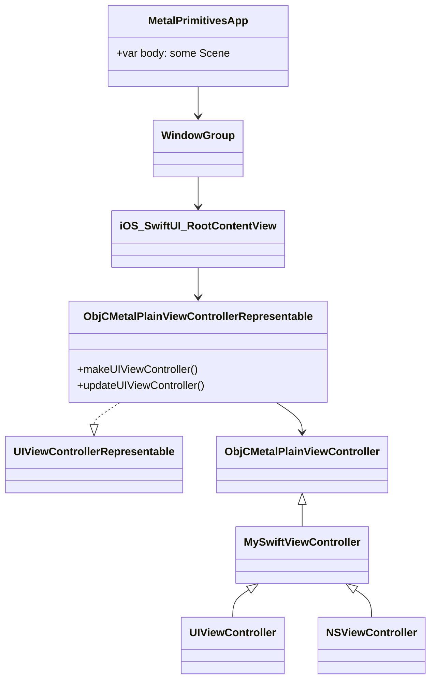

**Explanation:**

- `MetalPrimitivesApp` is the main entry point of the app, containing the `WindowGroup`.
- `iOS_SwiftUI_RootContentView` is the main SwiftUI view for iOS, which uses `ObjCMetalPlainViewControllerRepresentable` to bridge UIKit components.
- `ObjCMetalPlainViewControllerRepresentable` conforms to `UIViewControllerRepresentable` to integrate a UIKit view controller within SwiftUI.
- `ObjCMetalPlainViewController` is an Objective-C view controller that handles Metal rendering.

---

## **3. Class Diagram of View Controllers and Wrappers**

This diagram shows how the SwiftUI views, UIKit/AppKit view controllers, and Objective-C view controllers interact.

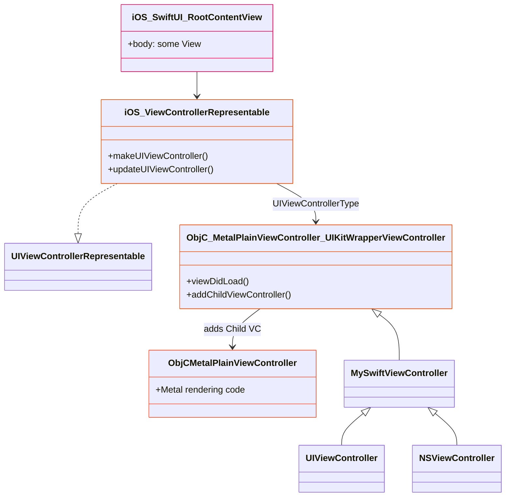


**Explanation:**

- `iOS_SwiftUI_RootContentView` is a SwiftUI view that includes `iOS_ViewControllerRepresentable`.
- `iOS_ViewControllerRepresentable` bridges the UIKit view controller (`ObjC_MetalPlainViewController_UIKitWrapperViewController`) into SwiftUI.
- `ObjC_MetalPlainViewController_UIKitWrapperViewController` is a UIKit view controller that adds the Objective-C Metal view controller as a child.
- `ObjCMetalPlainViewController` is the Objective-C view controller that handles Metal rendering.

---

## **4. App Initialization Sequence Diagram**

This sequence diagram illustrates the flow of control during the app's initialization, highlighting how views and view controllers are created and connected.

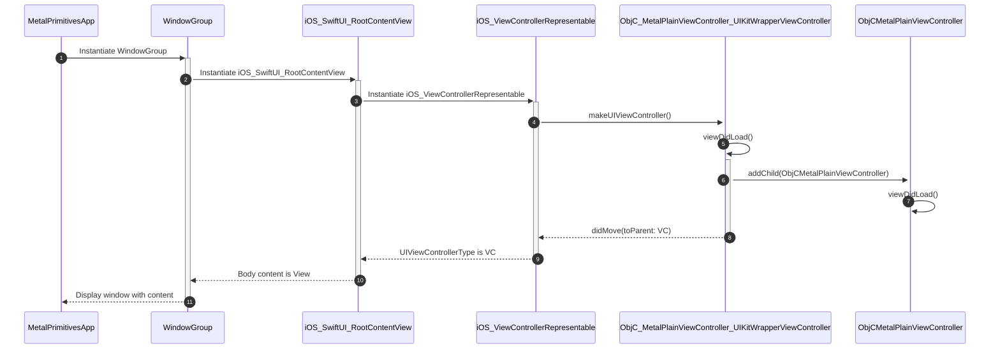

**Explanation:**

- The app starts by instantiating the `WindowGroup`.
- `WindowGroup` creates the `iOS_SwiftUI_RootContentView`.
- The `iOS_SwiftUI_RootContentView` initializes the `iOS_ViewControllerRepresentable`.
- `iOS_ViewControllerRepresentable` creates the `ObjC_MetalPlainViewController_UIKitWrapperViewController`.
- The wrapper view controller adds `ObjCMetalPlainViewController` as a child.
- Each view controller's `viewDidLoad` method is called appropriately.
- Control returns up the chain, and the window displays the content.

---

## **5. Metal Views and Renderers Class Diagram**

This diagram shows the relationship between the Metal views and their respective renderers.

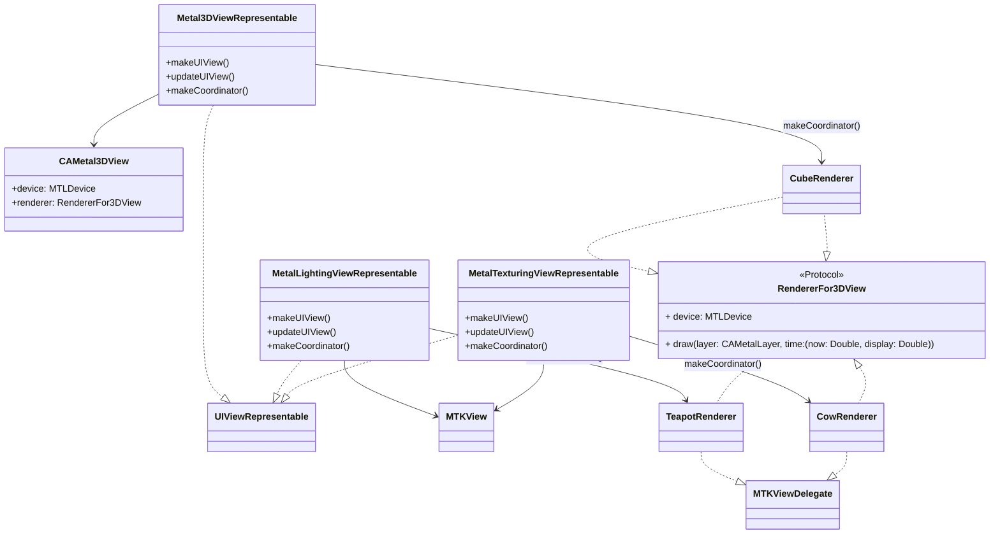

**Explanation:**

- Each representable view conforms to `UIViewRepresentable` and integrates a Metal view into SwiftUI.
- `Metal3DViewRepresentable` uses `CAMetal3DView`, which utilizes a custom renderer (`CubeRenderer`).
- `MetalLightingViewRepresentable` and `MetalTexturingViewRepresentable` use `MTKView` and custom renderers (`TeapotRenderer` and `CowRenderer` respectively).
- Renderers conform to either `RendererFor3DView` protocol or `MTKViewDelegate`.

---

## **6. Metal View Rendering Flow Sequence Diagram**

The following sequence diagram demonstrates how the Metal views are created and rendered within the app, showcasing the interaction between SwiftUI, `UIViewRepresentable`, and the Metal rendering pipeline.

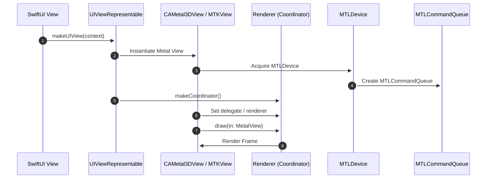

**Explanation:**

- The SwiftUI view calls `makeUIView(context)` on the `UIViewRepresentable`.
- The representable creates an instance of the Metal view (`CAMetal3DView` or `MTKView`).
- The Metal view acquires the `MTLDevice` and creates a `MTLCommandQueue`.
- The representable creates a coordinator, which acts as the renderer.
- The Metal view sets its delegate or renderer.
- On each frame, the Metal view calls the renderer's `draw` method to render the frame.

---

## **7. Platform-Specific View Creation Flowchart**

This flowchart demonstrates how the code handles platform-specific view creation using conditional compilation.

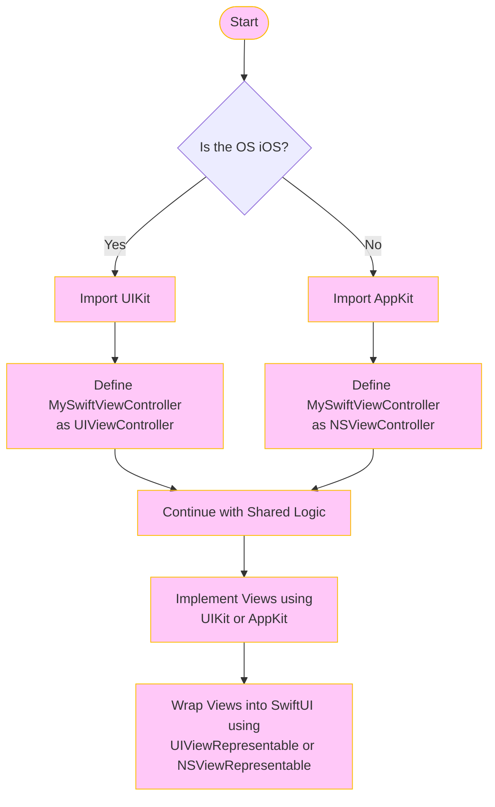

**Explanation:**

- The app starts and checks the operating system.
- If the OS is iOS, it imports UIKit and defines `MySwiftViewController` as `UIViewController`.
- If the OS is macOS, it imports AppKit and defines `MySwiftViewController` as `NSViewController`.
- Shared logic continues, and views are implemented using the appropriate framework.
- Views are wrapped into SwiftUI using the respective representable protocols.

---

## **8. Extensions and Utilities Relationships Diagram**

The class diagram below shows how extensions and utilities are designed to add functionality to existing structures like `CGPoint`, `CGSize`, and `CGRect`.

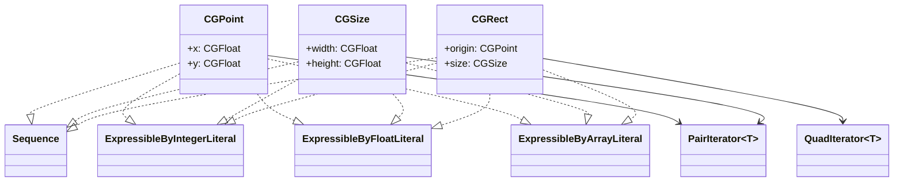

**Explanation:**

- `CGPoint`, `CGSize`, and `CGRect` are extended to conform to `Sequence` and various literal protocols.
- Custom iterators (`PairIterator` and `QuadIterator`) are used to enable iteration over the components of these structures.
- This adds syntactic sugar and convenience when working with these types in code.

---

## **9. Metal Rendering Process Flowchart**

This flowchart outlines the steps involved in the `CAMetalPlainView`'s rendering process.

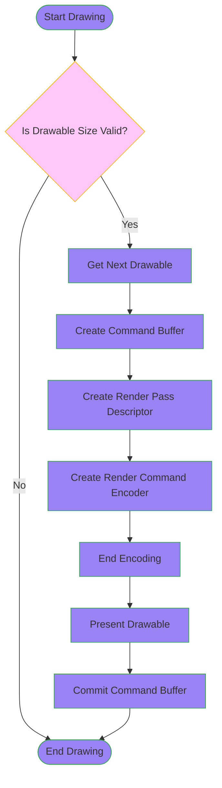

**Explanation:**

- The rendering process starts by checking if the drawable size is valid.
- If valid, it proceeds to get the next drawable from the layer.
- A command buffer is created, along with a render pass descriptor.
- A render command encoder is created to encode rendering commands.
- After encoding, the encoder is ended.
- The drawable is presented, and the command buffer is committed.
- The process ends, ready for the next frame.

---

## **10. Metal View Hierarchy and Custom Views Diagram**

This class diagram shows the hierarchy and relationships between custom Metal views and their UIKit/AppKit counterparts, emphasizing the shared logic across platforms.

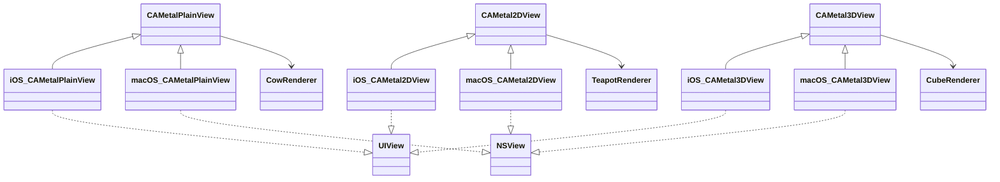

**Explanation:**

- Custom Metal views (`CAMetalPlainView`, `CAMetal2DView`, `CAMetal3DView`) are subclassed for iOS and macOS.
- These subclasses conform to their respective platform's view classes (`UIView` or `NSView`).
- Each Metal view uses a renderer that handles the drawing logic.

---

## **11. Configurable References and Protocol Extensions Diagram**

The class diagram below illustrates how protocols and extensions are used to provide configurable references across different types, enhancing code reusability and readability.

## TODO: Fix this mermaid diagram syntax
```mermaid
classDiagram
    %% Protocol
    class ConfigurableReference {
        +configure(block: (Self) -> Void): Self
    }

    %% Types Conforming to ConfigurableReference
    class NSObjectProtocol
    class MTLCommandQueue
    class CAMetalLayer
    class MTKView
    class MTLBuffer
    class NSLock

    NSObjectProtocol ..|> ConfigurableReference
    MTLCommandQueue ..|> ConfigurableReference
    CAMetalLayer ..|> ConfigurableReference
    MTKView ..|> ConfigurableReference
    MTLBuffer ..|> ConfigurableReference
    NSLock ..|> ConfigurableReference

    %% Extension Implementation
    extension NSObjectProtocol {
        +configure(block: (Self) -> Void): Self
    }
```

**Explanation:**

- The `ConfigurableReference` protocol allows objects to be configured using a closure.
- Several classes conform to this protocol, making it convenient to chain configurations.
- The protocol extension provides a default implementation for any `NSObjectProtocol` conforming type.

---

## **12. Core Graphics Extensions and Iterators Diagram**

This class diagram demonstrates how custom iterators are implemented for `CGPoint`, `CGSize`, and `CGRect`, enabling them to conform to `Sequence` and various literal protocols.


---

## **13. CAMetal2DView Class Diagram**

This diagram shows the class hierarchy and composition of `CAMetal2DView` and its inner class `MetalState`.

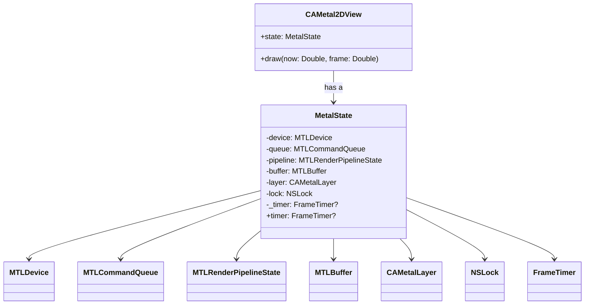

**Explanation:**

- `CAMetal2DView` contains an instance of `MetalState`, which holds all the Metal-related objects and state.
- `MetalState` manages the Metal device, command queue, pipeline state, buffers, and synchronization primitives.

---

## **14. CAMetal2DView Initialization and Rendering Sequence Diagram**

This diagram shows the sequence of events during initialization and the rendering loop of `CAMetal2DView`.

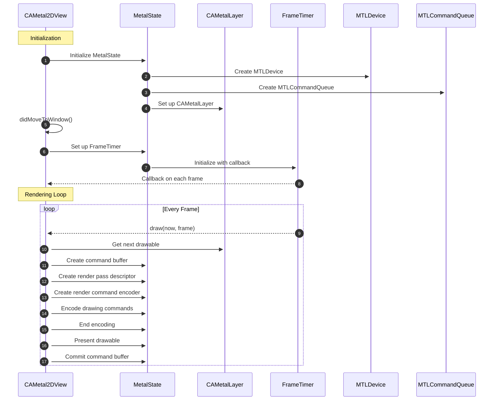

---

## **15. CAMetal2DView Draw Method Flowchart**

This flowchart details the steps taken within the `draw(now: frame:)` method during each frame of rendering.

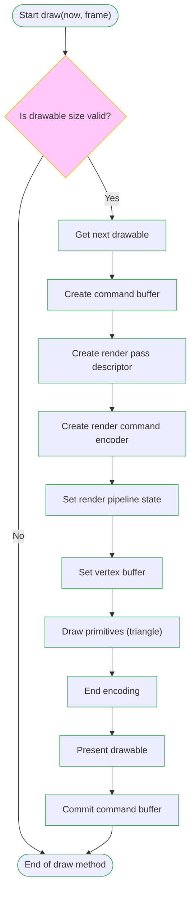

---

## **16. Shader Structures and Render Pipeline Diagram**

This class diagram illustrates the `ShaderVertexFor2DView` struct and its role in the rendering pipeline.

```mermaid
classDiagram
    class ShaderVertexFor2DView {
        +position: SIMD4<Float>
        +color: SIMD4<Float>
    }

    class MTLBuffer
    MetalState --> MTLBuffer : buffer
    MTLBuffer --> ShaderVertexFor2DView

    %% Shaders
    class MTLLibrary
    MetalState --> MTLLibrary : makeDefaultLibrary()
    MTLLibrary --> VertexFunction : makeFunction(name: "main_vertex_for_2D_view")
    MTLLibrary --> FragmentFunction : makeFunction(name: "main_fragment_for_2D_view")

    MetalState --> MTLRenderPipelineDescriptor : descriptor
    MTLRenderPipelineDescriptor --> VertexFunction
    MTLRenderPipelineDescriptor --> FragmentFunction
```

**Explanation:**

- `ShaderVertexFor2DView` defines the vertex data structure used in the shaders.
- `MTLBuffer` holds the vertex data.
- The Metal library loads the shader functions used in the render pipeline.
- The pipeline descriptor references the vertex and fragment shader functions.

---

## **17. Thread Safety and Synchronization Diagram**

This diagram illustrates how the `MetalState` class manages thread safety and synchronization using a lock when accessing the `timer` property.

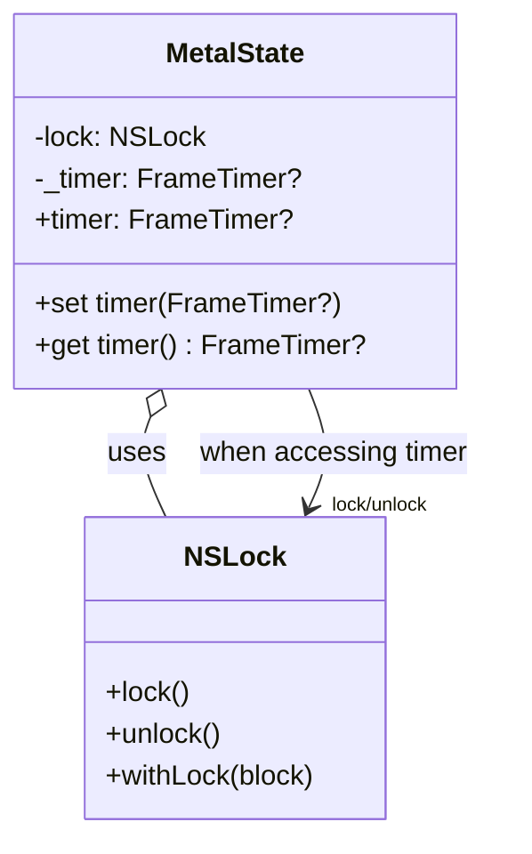

**Explanation:**

- `MetalState` uses an `NSLock` to ensure thread safety when accessing or modifying the `_timer` property.
- The `timer` getter and setter methods use the lock to synchronize access.
- This prevents race conditions and ensures that the timer is safely managed across threads.

---

# **Conclusion**

The provided diagrams offer a comprehensive visual representation of the Metal Primitives App's architecture, rendering pipeline, and class relationships. By examining these diagrams, developers can gain a deeper understanding of:

- How SwiftUI integrates with UIKit and AppKit through representable protocols.
- The rendering process using Metal, including device and command queue setup, pipeline configuration, and shader usage.
- The handling of platform-specific code using conditional compilation.
- The advanced rendering techniques implemented, such as lighting and texturing in custom shaders.
- The importance of thread safety and synchronization in managing rendering loops and state.

These visual aids serve as valuable references for developers looking to explore or extend the functionalities of the app, providing insights into best practices for cross-platform Metal rendering applications.
