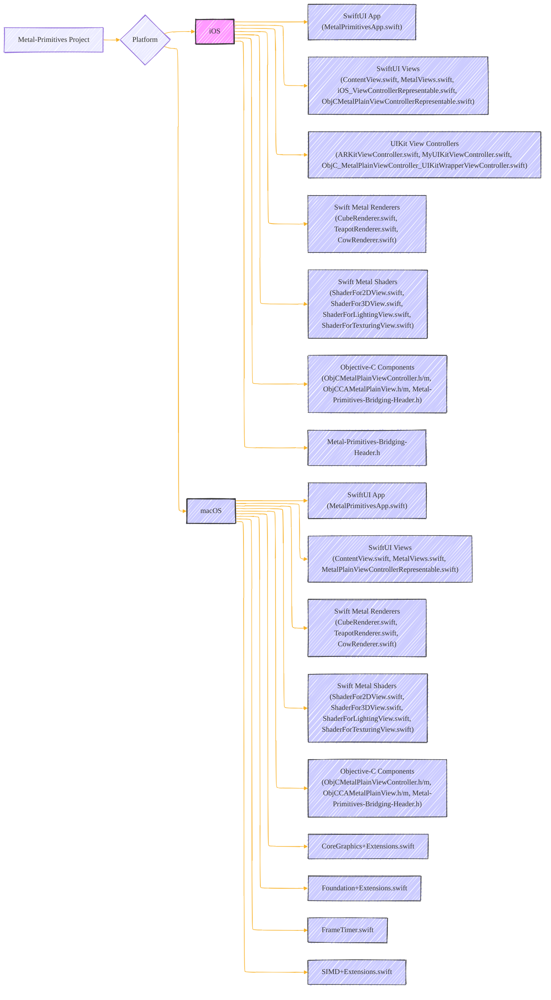
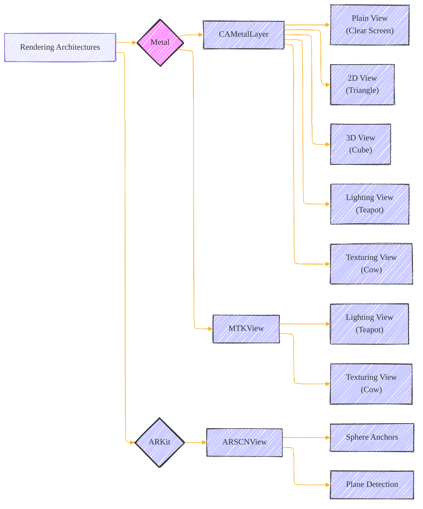
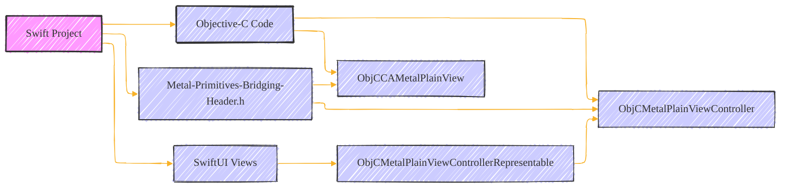
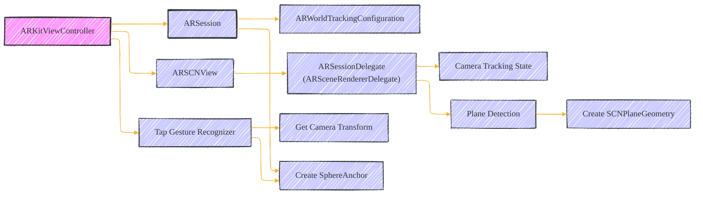
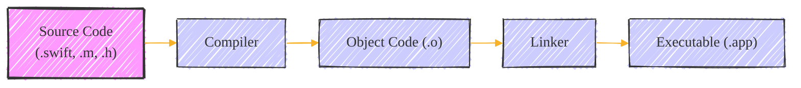

# Documentation - A Consolidated version - Draft 2
> This content is dual-licensed under your choice of the following licenses:
> 1.  **MIT License:** For the code implementations in Swift and Mermaid provided in this document.
> 2.  **Creative Commons Attribution 4.0 International License (CC BY 4.0):** For all other content, including the text, explanations, and the Mermaid diagrams and illustrations.

---

## 1. Project Overview and Structure

This project demonstrates various Metal rendering techniques and integrations within iOS and macOS applications. It leverages Swift, Objective-C, and Metal to showcase different rendering approaches, including:

*   **2D Rendering:** A simple triangle rendered using Metal.
*   **3D Rendering:** A rotating cube rendered with Metal.
*   **Lighting:** Rendering a teapot with lighting effects using Metal.
*   **Texturing:** Rendering a textured object (likely a cow or similar) using Metal.
*   **ARKit Integration:** Integrating ARKit to display a sphere in an augmented reality scene.
*   **SwiftUI Integration:** Uses SwiftUI `Representable` to embed UIKit/AppKit views.
*   **Objective-C Interoperability:** Utilizes Objective-C code ( `ObjCMetalPlainViewController`, `ObjCCAMetalPlainView` ) within a Swift project.

**Diagram 1: Project Structure**

*   This diagram shows the main components of the project, separated by platform (iOS and macOS).
*   It illustrates the dependencies between Swift code (SwiftUI, renderers, shaders), UIKit/AppKit, and Objective-C code.
*   The `Metal-Primitives-Bridging-Header.h` file is crucial for enabling Swift to interact with Objective-C code.

----

## 2.  Rendering Architectures

The project uses several different approaches to render the graphics.

**Diagram 2: Rendering Approaches**

*   **`CAMetalLayer`:** This is a Core Animation layer that allows direct drawing with Metal.
    *   Used in  `CAMetalPlainView`, `CAMetal2DView`, and `CAMetal3DView`.
    *   Offers more control over the rendering process.
*   **`MTKView`:**  A MetalKit view that simplifies Metal integration by handling setup and rendering loop.
    *   Used in `MetalLightingViewRepresentable` and `MetalTexturingViewRepresentable`.
    *   Provides a convenient delegate-based approach.
*   **ARKit:** Used to create an augmented reality experience with ARKit:
    *   The  `ARKitViewController`  class manages an  `ARSession`  and uses an  `ARSCNView`  to display the AR scene.
    *   Detects horizontal planes.
    *   Adds a  `SphereAnchor`  on a tap gesture.

---

## 3. Swift and Objective-C Interaction

The project demonstrates how to integrate Objective-C code into a Swift project.

**Diagram 3: Swift and Objective-C Interaction**

*   `Metal-Primitives-Bridging-Header.h`: This header file is the bridge between Swift and Objective-C. It's where you import Objective-C header files, making their classes and methods accessible in Swift.
*   `ObjCMetalPlainViewController` and `ObjCCAMetalPlainView`:  These are Objective-C classes that are likely used to create and manage a basic Metal view. The `ObjCMetalPlainViewControllerRepresentable`  wraps the Objective-C controller so that it can be displayed within a SwiftUI environment.

---

## 4. Code Highlights

*   **Metal Setup:**  The code initializes the Metal device (`MTLCreateSystemDefaultDevice()`) and command queue (`makeCommandQueue()`).
*   **Renderers:** `CubeRenderer`, `TeapotRenderer`, and `CowRenderer` encapsulate the logic for drawing 3D objects using Metal. They manage the Metal pipeline, vertex and index buffers, and uniforms.
*   **Shaders:** The Metal shader files (e.g., `ShaderFor2DView.metal`, `ShaderFor3DView.metal`) define the vertex and fragment shaders, which are responsible for transforming vertices and calculating pixel colors.
*   **SwiftUI Integration:**  The `UIViewRepresentable` and `NSViewRepresentable` protocols are used to embed UIKit/AppKit views (including Metal views) within SwiftUI.
*   **ARKit Integration:** The  `ARKitViewController`  class sets up the AR session, detects planes, and adds virtual objects to the AR scene.

---

## 5.  Key Components and Relationships

**Diagram 4:  Core Data Flow**

```mermaid
%%{
  init: {
    'theme': 'default',
    'layout': 'elk',
    'look': 'handDrawn',
    'fontFamily': 'verdana',
    'themeVariables': {
      'primaryColor': '#BB2528',
      'primaryTextColor': '#fff',
      'primaryBorderColor': '#7C0000',
      'lineColor': '#F8B229',
      'secondaryColor': '#006100',
      'tertiaryColor': '#fff'
    }
  }
}%%
graph LR
    A[MetalPrimitivesApp] --> B[SwiftUI Root View];
    B --> C{Platform};
    C --> D[iOS];
    C --> E[macOS];

    D --> F[iOS_SwiftUI_RootContentView];
    F --> G[ObjCMetalPlainViewControllerRepresentable];
    G --> H[ObjCMetalPlainViewController];
    H --> I[ObjCCAMetalPlainView];
    I --> J[CAMetalLayer];

    E --> K[macOS_SwiftUI_RootContentView];
    K --> L[MetalPlainViewControllerRepresentable];
    L --> H;
    H --> I;
    I --> J;

    subgraph Metal_Rendering_Simplified["Metal Rendering<br>(Simplified)"]
        J --> M[Metal Device];
        J --> N[Command Queue];
        J --> O[Render Pipeline];
        J --> P[Vertex Data];
        J --> Q[Fragment Shader];
    end

    style A fill:#f9f,stroke:#333,stroke-width:2px
    style B fill:#ccf,stroke:#333,stroke-width:2px
    style C fill:#ccf,stroke:#333,stroke-width:1px
    style D fill:#ccf,stroke:#333,stroke-width:1px
    style E fill:#ccf,stroke:#333,stroke-width:1px
    style F fill:#ccf,stroke:#333,stroke-width:1px
    style G fill:#ccf,stroke:#333,stroke-width:1px
    style H fill:#ccf,stroke:#333,stroke-width:1px
    style I fill:#ccf,stroke:#333,stroke-width:1px
    style J fill:#ccf,stroke:#333,stroke-width:1px
    style K fill:#ccf,stroke:#333,stroke-width:1px
    style L fill:#ccf,stroke:#333,stroke-width:1px
    style M fill:#ccf,stroke:#333,stroke-width:1px
    style N fill:#ccf,stroke:#333,stroke-width:1px
    style O fill:#ccf,stroke:#333,stroke-width:1px
    style P fill:#ccf,stroke:#333,stroke-width:1px
    style Q fill:#ccf,stroke:#333,stroke-width:1px
    click A "https://developer.apple.com/documentation/swiftui/app"
    click B "https://developer.apple.com/documentation/swiftui/view"
    click C "https://developer.apple.com/documentation/swiftui/view"
    click D "https://developer.apple.com/documentation/swiftui/view"
    click E "https://developer.apple.com/documentation/swiftui/view"
    click F "https://developer.apple.com/documentation/swiftui/view"
    click G "https://developer.apple.com/documentation/swiftui/view"
    click H "https://developer.apple.com/documentation/uikit/uiviewcontroller"
    click I "https://developer.apple.com/documentation/uikit/uiview"
    click J "https://developer.apple.com/documentation/quartzcore/cametallayer"
    click K "https://developer.apple.com/documentation/swiftui/view"
    click L "https://developer.apple.com/documentation/swiftui/view"
    click M "https://developer.apple.com/documentation/metal"
    click N "https://developer.apple.com/documentation/metal"
    click O "https://developer.apple.com/documentation/metal"
    click P "https://developer.apple.com/documentation/metal"
    click Q "https://developer.apple.com/documentation/metal"

```

*   This diagram illustrates the flow of data and control within the application.
*   It shows how the SwiftUI app ( `MetalPrimitivesApp` ) presents views which eventually lead to Metal rendering through the Objective-C Metal views.
*   The simplified Metal rendering section highlights the key steps in Metal's rendering pipeline.

---

## 6. ARKit Workflow

**Diagram 5: ARKit Workflow**

*   This diagram outlines the core steps in the ARKit integration.
*   The  `ARKitViewController`  configures the AR session, sets up the  `ARSCNView`, and handles user interactions.
*   Plane detection is used to create a visual representation of the detected planes.
*   Tap gestures trigger the creation of a  `SphereAnchor`  at the camera's position.

---

## 7. Metal Rendering Pipeline (Simplified)

**Diagram 6: Metal Rendering Pipeline**

```mermaid
%%{
  init: {
    'theme': 'default',
    'layout': 'elk',
    'look': 'handDrawn',
    'fontFamily': 'verdana',
    'themeVariables': {
      'primaryColor': '#BB2528',
      'primaryTextColor': '#fff',
      'primaryBorderColor': '#7C0000',
      'lineColor': '#F8B229',
      'secondaryColor': '#006100',
      'tertiaryColor': '#fff'
    }
  }
}%%
graph LR
    A[Vertex Data] --> B[Vertex Shader]
    B --> C[Primitive Assembly]
    C --> D[Rasterization]
    D --> E[Fragment Shader]
    E --> F[Depth Testing]
    F --> G[Blending]
    G --> H[Frame Buffer]

    style A fill:#f9f,stroke:#333,stroke-width:2px
    style B fill:#ccf,stroke:#333,stroke-width:1px
    style C fill:#ccf,stroke:#333,stroke-width:1px
    style D fill:#ccf,stroke:#333,stroke-width:1px
    style E fill:#ccf,stroke:#333,stroke-width:1px
    style F fill:#ccf,stroke:#333,stroke-width:1px
    style G fill:#ccf,stroke:#333,stroke-width:1px
    style H fill:#ccf,stroke:#333,stroke-width:1px

```

*   This diagram shows the general stages of a Metal rendering pipeline.
*   **Vertex Data**: Input data, including positions, colors, and texture coordinates.
*   **Vertex Shader**: Transforms vertex data.
*   **Primitive Assembly**: Assembles vertices into primitives (triangles, lines, etc.).
*   **Rasterization**: Converts primitives into fragments (pixels).
*   **Fragment Shader**: Calculates the color of each fragment.
*   **Depth Testing**: Determines which fragments are visible based on their depth.
*   **Blending**: Combines fragment colors.
*   **Frame Buffer**: The final output, which is displayed on the screen.

---

## 8. SwiftUI Lifecycle (Simplified)

**Diagram 7: SwiftUI Lifecycle (Simplified)**

```mermaid
%%{
  init: {
    'theme': 'default',
    'layout': 'elk',
    'look': 'handDrawn',
    'fontFamily': 'verdana',
    'themeVariables': {
      'primaryColor': '#BB2528',
      'primaryTextColor': '#fff',
      'primaryBorderColor': '#7C0000',
      'lineColor': '#F8B229',
      'secondaryColor': '#006100',
      'tertiaryColor': '#fff'
    }
  }
}%%
graph LR
    A["App Launch"] --> B["ContentView.init()"]
    B --> C["Environment Setup"]
    C --> D["Scene Creation"]
    D --> E["View Hierarchy Construction"]
    E --> F["Body Computed"]
    F --> G["View Rendering"]
    G --> H["User Interaction"]
    H -- Changes --> F

    style A fill:#f9f,stroke:#333,stroke-width:2px
    style B fill:#ccf,stroke:#333,stroke-width:1px
    style C fill:#ccf,stroke:#333,stroke-width:1px
    style D fill:#ccf,stroke:#333,stroke-width:1px
    style E fill:#ccf,stroke:#333,stroke-width:1px
    style F fill:#ccf,stroke:#333,stroke-width:1px
    style G fill:#ccf,stroke:#333,stroke-width:1px
    style H fill:#ccf,stroke:#333,stroke-width:1px

```

*   This diagram shows a high-level overview of a SwiftUI app's lifecycle.
*   **App Launch:** The application starts.
*   **`ContentView.init()`:** The main view is initialized.
*   **Environment Setup:**  The SwiftUI environment is set up.
*   **Scene Creation:** The app creates the scene.
*   **View Hierarchy Construction:** SwiftUI builds the view hierarchy.
*   **Body Computed:** The `body` property of views is computed to describe their content.
*   **View Rendering:** The view is rendered on the screen.
*   **User Interaction:** User actions trigger updates, potentially causing the `body` to be recomputed and the view to be re-rendered.

---

## 9. Code Compilation and Linking

*   **Source Code:** The `.swift`, `.m`, and `.h` files.
*   **Compiler:** Transforms the source code into object code (`.o`).
*   **Linker:** Combines the object code files, resolves dependencies, and creates the executable application (`.app`).

---

## 10. Extensions and Utilities

*   **`CoreGraphics+Extensions.swift`:**  Provides extensions to Core Graphics types (like `CGPoint`, `CGSize`, `CGRect`) to make them conform to protocols like `Sequence` and `ExpressibleByArrayLiteral`. This enhances their usability in Swift code.
*   **`Foundation+Extensions.swift`:**  Contains extensions for Foundation classes. This file includes `ConfigurableReference` which simplifies the configuration of objects using a closure-based approach, and also extension for String to create bundle identifier.
*   **`FrameTimer.swift`:** Implements a frame timer to synchronize rendering with the display's refresh rate.  It uses `CVDisplayLink` on macOS and `CADisplayLink` on iOS.
*   **`SIMD+Extensions.swift`:** Provides useful extensions for SIMD (Single Instruction, Multiple Data) types, commonly used in Metal for vector and matrix operations. Includes convenient properties and methods.

---
**Licenses:**

- **MIT License:**   - Full text in [LICENSE](LICENSE) file.
- **Creative Commons Attribution 4.0 International:**  - Legal details in [LICENSE-CC-BY](LICENSE-CC-BY) and at [Creative Commons official site](http://creativecommons.org/licenses/by/4.0/).

---