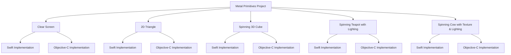
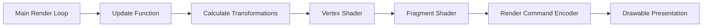

# Metal Primitives in Swift and Objective-C

This project demonstrates the basic primitives of the Metal framework by Apple, showcasing how to render various graphics using Metal in both **Swift** and **Objective-C**. It serves as an educational resource for developers interested in graphics programming on **iOS** and **macOS** platforms.

## Overview

The project covers a range of rendering examples:

- **Clear Screen**: Basics of setting up a Metal view and clearing the screen with a solid color.
- **Draw 2D Triangle**: Rendering a simple 2D triangle on the screen.
- **Draw Spinning 3D Cube**: Displaying a rotating 3D cube with basic transformations.
- **Draw Spinning Teapot with Manual Lighting**: Rendering a spinning teapot model with custom lighting effects.
- **Draw Spinning Cow with Manual Lighting and Custom Texture**: Displaying a textured cow model with lighting.

Each example is fully programmatic—**no Storyboards, XIBs, or NIBs** are used—providing a clear understanding of the code involved in setting up and rendering Metal views.

## Motivation

This project is a migration and enhancement of the code from Warren Moore's book, [*Metal by Example*](https://warrenmoore.net/), originally written in 2015. By updating the code to support the latest versions of Swift and Objective-C, and integrating it with both iOS and macOS platforms, we aim to make Metal's functionalities more accessible to modern developers.

The project also incorporates cross-platform support from [dehesa/sample-metal](https://github.com/dehesa/sample-metal), allowing the examples to run seamlessly on different operating systems and frameworks. By connecting all the code into a single app, we've streamlined the learning experience.

## Features

- **Cross-Platform Rendering**: Examples run on both **iOS devices** and **macOS** systems.
- **Swift and Objective-C**: Implementations in both languages to cater to a wider range of developers.
- **Mermaid Diagrams**: Each Metal view includes **Mermaid diagrams** explaining code functionalities and the relationships among code blocks.
- **100% Programmatic UI**: No Interface Builder files; all views are created via code for better transparency.
- **Educational Focus**: Code is well-documented and structured to facilitate learning.

## Code Structure

The project is organized into modules, each demonstrating a specific Metal rendering concept. Below is an overview of the code structure:



### Modules and Descriptions

- **Clear Screen**: Initializes a Metal view and clears the screen with a solid color. This is the foundational step for any rendering task in Metal.
- **2D Triangle**: Introduces basic rendering by drawing a simple 2D triangle using vertex and fragment shaders.
- **Spinning 3D Cube**: Demonstrates 3D rendering with rotation, showcasing transformations and perspective projection.
- **Spinning Teapot with Lighting**: Incorporates manual lighting techniques on a teapot model, illustrating normals, light positioning, and shading.
- **Spinning Cow with Texture & Lighting**: Combines advanced lighting and texturing on a cow model, demonstrating how to apply textures and manipulate material properties.

Each module includes detailed **Mermaid diagrams** within its documentation to visually represent the flow of data and the relationships between code components.

## Getting Started

### Prerequisites

- **Xcode 13** or later (supports both Swift and Objective-C)
- **iOS 13** or later / **macOS 10.15** or later
- **Swift 5** or later

### Installation

1. **Clone the Repository**:

   ```bash
   git clone https://github.com/CongLeSolutionX/Metal-Primitives.git
   ```

2. **Open the Project in Xcode**:

   ```bash
   cd Metal-Primitives
   open MetalPrimitives.xcodeproj
   ```

3. **Select the Target**:

   - Choose either the **iOS** or **macOS** target depending on your development environment.

4. **Build and Run**:

   - Press `Cmd + R` to build and run the project on your device or simulator.

## Understanding the Code

### Programmatic Views

All views in this project are created programmatically. This approach provides:

- **Full Transparency**: Understanding exactly how views are initialized and managed.
- **Flexibility**: Easier to manipulate views dynamically.
- **No Storyboard Constraints**: Avoids issues related to storyboard merges in collaborative environments.

### Mermaid Diagrams

To help visualize the architecture and flow of each example, we've included **Mermaid diagrams** in the documentation of each module.

#### Example Diagram: Spinning 3D Cube



These diagrams illustrate:

- **Render Pipeline**: The sequence of steps from updating data to presenting the drawable.
- **Shader Relationships**: How vertex and fragment shaders interact with the rendering process.
- **Data Flow**: The movement of data through buffers and encoders.

## Learning Objectives

By exploring this project, you will:

- **Understand Metal Basics**: Learn how to set up a Metal environment and render basic shapes.
- **Work with Shaders**: Write and modify vertex and fragment shaders for custom rendering effects.
- **Implement Transformations**: Apply translations, rotations, and scaling to 3D objects.
- **Apply Lighting Models**: Understand how lighting affects rendering and how to implement it manually.
- **Work with Textures**: Load and apply textures to 3D models for more realistic effects.
- **Develop Cross-Platform Code**: Write code that runs on both iOS and macOS platforms.

## Resources and References

- **Warren Moore's Blog**: [warrenmoore.net](https://warrenmoore.net/)
- **Metal Official Documentation**: [Apple Developer - Metal](https://developer.apple.com/metal/)
- **dehesa/sample-metal Repository**: [GitHub - dehesa/sample-metal](https://github.com/dehesa/sample-metal)
- **Metal by Example Book**: *Metal by Example* by Warren Moore

## Contributing

We welcome contributions! If you'd like to improve the project, please:

1. **Fork the Repository**: Create your own fork on GitHub.
2. **Create a Feature Branch**: 

   ```bash
   git checkout -b feature/YourFeature
   ```

3. **Commit Your Changes**:

   ```bash
   git commit -m 'Add your feature'
   ```

4. **Push to the Branch**:

   ```bash
   git push origin feature/YourFeature
   ```

5. **Open a Pull Request**: Submit your changes for review.

## License

This project is licensed under the **MIT License**. See the [LICENSE](LICENSE) file for details.