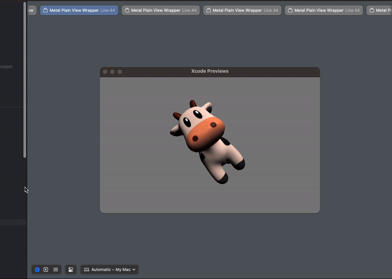
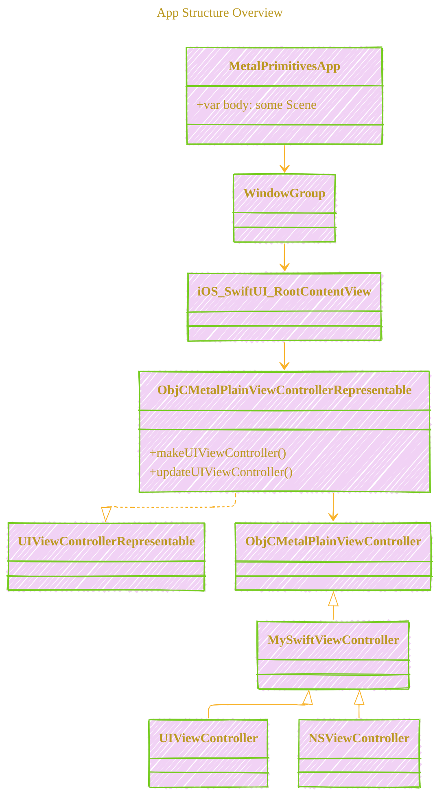
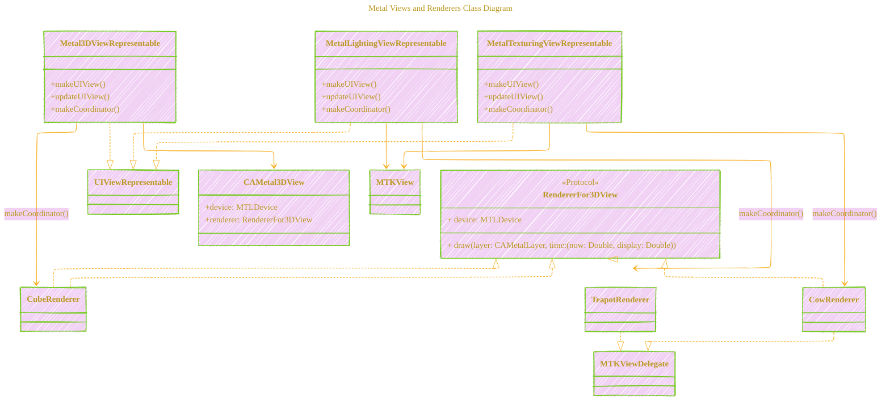

# Metal Primitives in Swift and Objective-C

[](LICENSE)  [](LICENSE-CC-BY)

> Copyright © 2025 Cong Le. All Rights Reserved.

---

This project demonstrates the basic primitives of the Metal framework by Apple, showcasing how to render various graphics using Metal in both **Swift** and **Objective-C**. It serves as an educational resource for developers interested in graphics programming on **iOS** and **macOS** platforms.

----


## Overview

The project covers a range of rendering examples:

- **Clear Screen**: Basics of setting up a Metal view and clearing the screen with a solid color.
- **Draw 2D Triangle**: Rendering a simple 2D triangle on the screen.
- **Draw Spinning 3D Cube**: Displaying a rotating 3D cube with basic transformations.
- **Draw Spinning Teapot with Manual Lighting**: Rendering a spinning teapot model with custom lighting effects.
- **Draw Spinning Cow with Manual Lighting and Custom Texture**: Displaying a textured cow model with lighting.

Each example is fully programmatic—**no Storyboards, XIBs, or NIBs** are used—providing a clear understanding of the code involved in setting up and rendering Metal views.

---


## Demo

Here is the previews of multiple metal screens rendering on an iOS simulator:


Here is the previews of multiple metal screens rendering on a macOS simulator:




---


## Motivation

This project is a migration and enhancement of the code from Warren Moore's book, [*Metal by Example*](https://warrenmoore.net/), originally written in 2015. By updating the code to support the latest versions of Swift and Objective-C, and integrating it with both iOS and macOS platforms, we aim to make Metal's functionalities more accessible to modern developers.

The project also incorporates cross-platform support from [dehesa/sample-metal](https://github.com/dehesa/sample-metal), allowing the examples to run seamlessly on different operating systems and frameworks. By connecting all the code into a single app, we've streamlined the learning experience.

---


## Features

- **Cross-Platform Rendering**: Examples run on both **iOS devices** and **macOS** systems.
- **Swift and Objective-C**: Implementations in both languages to cater to a wider range of developers.
- **Mermaid Diagrams**: Each Metal view includes **Mermaid diagrams** explaining code functionalities and the relationships among code blocks.
- **100% Programmatic UI**: No Interface Builder files; all views are created via code for better transparency.
- **Educational Focus**: Code is well-documented and structured to facilitate learning.

---


## Code Structure

### High-Level Architecture Diagram

This diagram provides an overview of the entire app's architecture, highlighting the conditional compilation for iOS and macOS platforms and how different views are integrated.


**Explanation:**

- The `MetalPrimitivesApp` uses a `WindowGroup` to host the main content.
- Based on the platform (iOS or macOS), it conditionally includes different views.
- The iOS Views and macOS Views are grouped under their respective platforms.
- Each platform includes a set of representable views that integrate Metal rendering into SwiftUI.

---

### App Structure Overview

This class diagram illustrates the overall structure of the app, focusing on the relationships between the main app entry point, SwiftUI views, and UIKit/AppKit view controllers.



**Explanation:**

- `MetalPrimitivesApp` is the main entry point of the app, containing the `WindowGroup`.
- `iOS_SwiftUI_RootContentView` is the main SwiftUI view for iOS, which uses `ObjCMetalPlainViewControllerRepresentable` to bridge UIKit components.
- `ObjCMetalPlainViewControllerRepresentable` conforms to `UIViewControllerRepresentable` to integrate a UIKit view controller within SwiftUI.
- `ObjCMetalPlainViewController` is an Objective-C view controller that handles Metal rendering.


For more details and illustrations, please check out [Documentation.md](/DOCUMENTATIONS/Documentation.md).

----


## Getting Started

### Prerequisites

- **Xcode 13** or later (supports both Swift and Objective-C)
- **iOS 13** or later / **macOS 10.15** or later
- **Swift 5** or later

### Installation

1. **Clone the Repository**:

   ```bash
   git clone https://github.com/CongLeSolutionX/Metal-Primitives.git
   ```

2. **Open the Project in Xcode**:

   ```bash
   cd Metal-Primitives
   open MetalPrimitives.xcodeproj
   ```

3. **Select the Target**:

   - Choose either the **iOS** or **macOS** target depending on your development environment.

4. **Build and Run**:

   - Press `Cmd + R` to build and run the project on your device or simulator.

----

## Understanding the Code

### Programmatic Views

All views in this project are created programmatically. This approach provides:

- **Full Transparency**: Understanding exactly how views are initialized and managed.
- **Flexibility**: Easier to manipulate views dynamically.
- **No Storyboard Constraints**: Avoids issues related to storyboard merges in collaborative environments.

### Mermaid Diagrams

To help visualize the architecture and flow of each example, we've included **Mermaid diagrams** in the documentation of each module.

#### Example: Metal Views and Renderers Class Diagram

This diagram shows the relationship between the Metal views and their respective renderers.



**Explanation:**

- Each representable view conforms to `UIViewRepresentable` and integrates a Metal view into SwiftUI.
- `Metal3DViewRepresentable` uses `CAMetal3DView`, which utilizes a custom renderer (`CubeRenderer`).
- `MetalLightingViewRepresentable` and `MetalTexturingViewRepresentable` use `MTKView` and custom renderers (`TeapotRenderer` and `CowRenderer` respectively).
- Renderers conform to either `RendererFor3DView` protocol or `MTKViewDelegate`.

----


## Learning Objectives

By exploring this project, you will:

- **Understand Metal Basics**: Learn how to set up a Metal environment and render basic shapes.
- **Work with Shaders**: Write and modify vertex and fragment shaders for custom rendering effects.
- **Implement Transformations**: Apply translations, rotations, and scaling to 3D objects.
- **Apply Lighting Models**: Understand how lighting affects rendering and how to implement it manually.
- **Work with Textures**: Load and apply textures to 3D models for more realistic effects.
- **Develop Cross-Platform Code**: Write code that runs on both iOS and macOS platforms.

----


## Resources and References

- **Warren Moore's Blog**: [warrenmoore.net](https://warrenmoore.net/)
- **Metal Official Documentation**: [Apple Developer - Metal](https://developer.apple.com/metal/)
- **dehesa/sample-metal Repository**: [GitHub - dehesa/sample-metal](https://github.com/dehesa/sample-metal)
- **Metal by Example Book**: *Metal by Example* by Warren Moore


---


## Contributing

We welcome contributions! If you'd like to improve the project, please:

1. **Fork the Repository**: Create your own fork on GitHub.
2. **Create a Feature Branch**: 

   ```bash
   git checkout -b feature/YourFeature
   ```

3. **Commit Your Changes**:

   ```bash
   git commit -m 'Add your feature'
   ```

4. **Push to the Branch**:

   ```bash
   git push origin feature/YourFeature
   ```

5. **Open a Pull Request**: Submit your changes for review.


----

## 🚀 Project Current Activities

<div align="center">
	
	<br/>
	<em>gif image is provided by <a href="https://giphy.com">Giphy</a></em>
</div>


<div align="left"><a name="project-current-activities"></a>

<details open>
<summary>Click to show/hide more on recent activities of this project </summary>

> powered by [OSS Insight](https://ossinsight.io)
<!-- All the diagrams below are made with [OSS Insight](https://ossinsight.io/) -->

| :bar_chart: Widget & Description | :art: Snapshot (Light Mode) |
|---|---|
| Active Contributors :technologist: of CongLeSolutionX/Metal-Primitives - Last 28 days |  <br/> :link: [View Full Report :mag:](https://next.ossinsight.io/widgets/official/compose-recent-active-contributors?repo_id=905968227&limit=30) |
| Pushes :arrow_up: and Commits :writing_hand: of CongLeSolutionX/Metal-Primitives |  <br/> :link: [View Full Report :mag:](https://next.ossinsight.io/widgets/official/analyze-repo-pushes-and-commits-per-month?repo_id=905968227) |
| Pull Request Size :straight_ruler: of CongLeSolutionX/Metal-Primitives |  <br/> :link: [View Full Report :mag:](https://next.ossinsight.io/widgets/official/analyze-repo-pull-requests-size-per-month?repo_id=905968227) |
| Pull Request Lifecycle :arrows_counterclockwise: of CongLeSolutionX/Metal-Primitives |  <br/> :link: [View Full Report :mag:](https://next.ossinsight.io/widgets/official/analyze-repo-pull-request-open-to-merged?repo_id=905968227) |
| Lines of Code Changes :computer::scroll: of CongLeSolutionX/Metal-Primitives |  <br/> :link: [View Full Report :mag:](https://next.ossinsight.io/widgets/official/analyze-repo-loc-per-month?repo_id=905968227) |
| Commits Time Distribution :alarm_clock::date: of CongLeSolutionX/Metal-Primitives |  <br/> :link: [View Full Report :mag:](https://next.ossinsight.io/widgets/official/analyze-repo-commits-time-distribution?repo_id=905968227&period=last_1_year&zone=0) | 

</details>

</div>

<div align="center">
	
	<br/>
	<em>gif image is provided by <a href="https://giphy.com">Giphy</a></em>
</div>


----

## License

- **MIT License:**  [](LICENSE) - Full text in [LICENSE](LICENSE) file.
- **Creative Commons Attribution 4.0 International:** [](LICENSE-CC-BY) - Legal details in [LICENSE-CC-BY](LICENSE-CC-BY) and at [Creative Commons official site](http://creativecommons.org/licenses/by/4.0/).


---

```mermaid
---
title: "CongLeSolutionX"
author: "Cong Le"
version: "1.0"
license(s): "MIT, CC BY 4.0"
copyright: "Copyright (c) 2025 Cong Le. All Rights Reserved."
config:
  theme: base
---
%%%%%%%% Mermaid version v11.4.1-b.14
%%{
  init: {
    'flowchart': { 'htmlLabels': false },
    'fontFamily': 'Brush Script MT',
    'themeVariables': {
      'primaryColor': '#fc82',
      'primaryTextColor': '#F8B229',
      'primaryBorderColor': '#27AE60',
      'secondaryColor': '#81c784',
      'secondaryTextColor': '#6C3483',
      'lineColor': '#F8B229',
      'fontSize': '20px'
    }
  }
}%%
flowchart LR
    My_Meme@{ img: "https://github.com/CongLeSolutionX/MY_GRAPHIC_ASSETS/blob/Designing_graphic_syntax/MY_MEME_ICONS/Orange-Cloud-Search-Icon-Base-Color-Black-1024x1024.png?raw=true", label: "Ăn uống gì chưa ngừi đẹp?", pos: "b", w: 200, h: 150, constraint: "on" }

    Closing_quote@{ shape: braces, label: "Math and code work together to bring interactive art to life!" }

Link_to_my_profile{{"<a href='https://github.com/CongLeSolutionX' target='_blank'>Click here if you care about my profile</a>"}}

Closing_quote ~~~ My_Meme
My_Meme animatingEdge@--> Link_to_my_profile
animatingEdge@{ animate: true }

```

----
